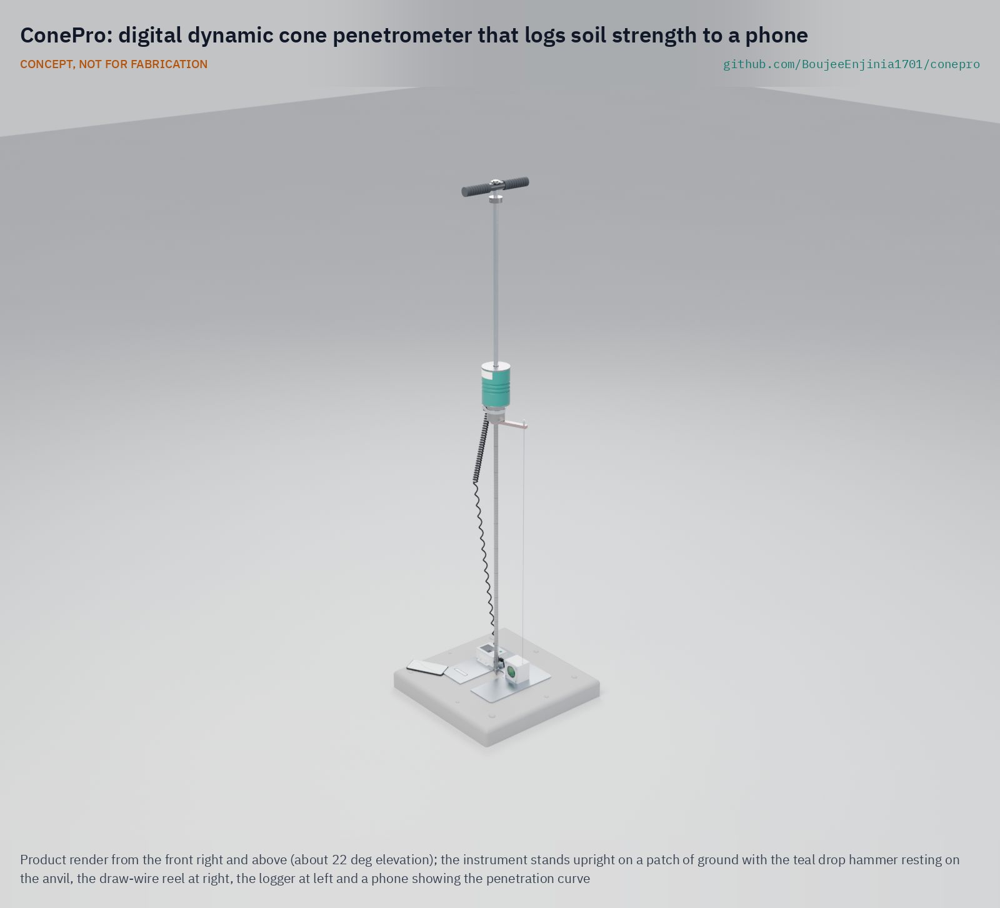

# ConePro

     

**Area:** Situational Field Hardware · **TRL:** 3 of 9 (proof of concept on paper) · **Value-engineering target:** about $400 USD (hypothetical control target; estimated instrument cost $335) · **Difficulty:** 3 of 5

Portable dynamic cone penetrometer with a digital depth encoder and blow counter that logs penetration curves to a phone.

[Exploded render](media/render-exploded.png) · [Detail render](media/render-detail.png) · [Interactive 3D model](media/viewer.html) · [Concept blueprint (PDF)](media/concept-blueprint.pdf) · [General arrangement CNP-DWG-001 (PDF)](cad/drawings/CNP-DWG-001.pdf) · [Calculations](docs/04-calcs/01-sizing.md) · [Prototype build plan](docs/05-build-plan.md) · [Design decisions](docs/06-design-decisions.md) · [Review note](docs/REVIEW.md)

## Concept rationale

The dynamic cone penetrometer is already the cheapest credible way to profile soil strength in the field, and decades of published correlations depend on its exact geometry. ConePro therefore changes nothing about the hammer, drop, rod or cone and adds only what the manual test lacks: an automatic depth reading, a blow count, a tilt check and a clean digital record. That lets one person do what took two, and keeps every result comparable with existing DCP data.

It is open and garage-buildable because the users who most need fast soil screening, such as small contractors, NGO engineers and rural road agencies, are the least able to buy or repair closed instrumented penetrometers. The steel parts are simple machined pieces any local shop can make, the electronics are off-the-shelf modules on three AA cells, and the sensor set is designed to clamp onto penetrometers people already own.

## Burning platform

Roads, shelters and water points all sit on ground whose strength is usually guessed rather than measured. The World Bank estimates that about [one billion rural people, one in eight people worldwide, live more than 2 km from an all-season road](https://datatopics.worldbank.org/sdgatlas/goal-9-industry-innovation-and-infrastructure/), and a 2026 dataset of 50 African countries and regions found an [average paved rate of only 17.4 %](https://essd.copernicus.org/articles/18/267/2026/) (Liu et al., *Earth System Science Data* 18, 267). The same authors note that most unpaved roads are dirt, and building or upgrading such a road starts from the strength of the ground beneath it.

Laboratory strength testing has long been skipped for reasons of time and cost: in 1956 Scala wrote that "very few road authorities use a strength test in evaluating the subgrade of a road" and proposed quick static and dynamic cone tests instead ([TRID record](https://trid.trb.org/View/1194062)). The DCP descends from that work. Even a well-resourced agency runs it as a two-person, pencil-and-form test: Minnesota's user guide describes one person on the hammer and a second reading and recording [the penetration for each blow](https://mdl.mndot.gov/index.php/_flysystem/fedora/2023-08/1993mrrdoc002.pdf). Removing that second person and the transcription step is what lets more points be tested per day where it matters.

## Where it could be used

### By industry

| Industry | Use |
| --- | --- |
| Low-volume and rural roads | Subgrade and gravel layer strength along a route, for DCP-based pavement design and maintenance planning |
| Humanitarian shelter and WASH | Screening ground for shelters, water tanks, latrines and access tracks where no lab is within reach |
| Utilities and civil contracting | Checking compaction of trench backfill and pipe bedding before reinstatement |
| Building and site preparation | A first look at pad and footing areas to decide where a geotechnical engineer should investigate |
| Mining and agriculture haul roads | Rapid checks of unsealed haul and farm roads after rain |
| Teaching and research | An open instrument and data format for soil mechanics courses and correlation studies |

### By country or region

| Country or region | Why it matters there |
| --- | --- |
| Burkina Faso | A Rural Access Index of [23.8 in 2020](https://datatopics.worldbank.org/sdgatlas/goal-9-industry-innovation-and-infrastructure/): only about one in four rural people live near a road usable year-round |
| Zambia and Kenya | Rural access ranges from [17 % in Zambia (2011) to 56 % in Kenya (2009)](https://datatopics.worldbank.org/sdgatlas/goal-9-industry-innovation-and-infrastructure/), so many earth and gravel roads are still to be built or upgraded |
| Peru | A Rural Access Index of [37.2 % in the 2017/18 update](https://documents1.worldbank.org/curated/en/543621569435525309/pdf/World-Measuring-Rural-Access-Update-2017-18.pdf), above 50 % in some Andean departments but below 5 % in Amazon regions, so many rural roads are still to be built on untested ground |
| Bangladesh | Rural access of [87 % in the World Bank's 2016 pilot](https://documents1.worldbank.org/curated/en/543621569435525309/pdf/World-Measuring-Rural-Access-Update-2017-18.pdf), the highest of the pilot countries, so much of the rural network already exists and the work shifts to checking and maintaining it |
| United States | Minnesota has used the DCP as an [acceptance tool for edge drain trench compaction since 1993](https://mdl.mndot.gov/index.php/_flysystem/fedora/2023-08/1993mrrdoc002.pdf), a high-income example of routine, repeated field testing |
| Australia and New Zealand | Scala's 1956 paper to the second Australia New Zealand Conference on Soil Mechanics and Foundation Engineering set out the quick cone tests from which the DCP descends ([TRID record](https://trid.trb.org/View/1194062); [Informit record](https://search.informit.org/doi/10.3316/informit.218423931293630)), a lineage ConePro keeps by leaving the hammer, rod and cone unchanged |

## What sparked the idea

The starting point was the construction of the Minnesota Road Research Project (Mn/ROAD) test road on Interstate 94 near Albertville ([MnDOT MnROAD](https://www.dot.state.mn.us/mnroad/)), where the Minnesota Department of Transportation ran more than 700 DCP tests during construction. That work led the department to write a [user guide to the dynamic cone penetrometer](https://mdl.mndot.gov/index.php/_flysystem/fedora/2023-08/1993mrrdoc002.pdf) ([catalog record](https://mdl.mndot.gov/items/m14731)). The guide shows both why the DCP spread and where it stalls: the instrument was valued for its portability and ease of use, yet the method it describes still needs a two-person crew, one on the hammer and one reading the rod against a reference and writing each blow on a standard form. ConePro takes that documented workflow and asks what it would take for one person to run it with the reading and the form done automatically.

## Problem

Early site assessments need soil bearing data, but lab geotech is slow. The manual dynamic cone penetrometer (ASTM D6951) is fast and cheap but needs two people, a rule and hand-written records, and existing instrumented penetrometers are closed and costly. Full problem statement: [docs/01-problem.md](docs/01-problem.md)

## Concept

Portable dynamic cone penetrometer with a digital depth encoder and blow counter that logs penetration curves to a phone. ConePro keeps the standard geometry (8 kg hammer, 575 mm drop, 20 mm 60 degree cone), measures penetration with a draw-wire sensor referenced to a plate on the ground, counts blows and reads rod tilt with a clamp-on Hall and accelerometer pad at the anvil, and sends each blow to a phone app that plots the profile and gives an indicative CBR. The sensor set is designed to fit existing standard penetrometers too. TRL 3 calculations give about 28 J at the cone, 850 mm per rod, about 40 h on three AA cells and $335 in parts; the instrument carried in its bag is about 15.7 kg, within the 16 kg target, and a 500 mm extension rod is an optional accessory for deeper tests. Depth accuracy and shock survival are still at risk. Results are for screening, not foundation design.

Full design precis: [docs/02-concept.md](docs/02-concept.md)

## Key components

- Hardened 20 mm, 60 degree cone and 16 mm steel rods
- 8 kg drop hammer with a 575 mm drop
- Draw-wire depth sensor on a ground reference plate (laser rangefinder as the fallback)
- Clamp-on sensor pad at the anvil: Hall-effect blow switch and tilt accelerometer on an isolator
- BLE logger on three AA cells
- Optional lever rod puller and 500 mm extension rod, carried separately

The priced bill of materials is in [bom/bom.csv](bom/bom.csv). Parametric geometry is in [cad/src/model.py](cad/src/model.py), with STEP and STL exports in `cad/step/` and `cad/stl/`.

## Building the prototype

The design has been made constructable: every part can be turned, drilled, cut, printed or bought, and every joint has a fixing (decision record CNP-DDR-004, accepted by Amish on 2026-10-02). The [prototype build plan](docs/05-build-plan.md) (CNP-BLD-001) shows how to make each of the 16 components and assemble them in 13 steps, with a making sketch for every made part (CNP-DWG-101 to 113), close-ups of the joints and a picture for every step. It is a plan, not a record of a build; building to it is TRL 4 work. Decisions still open are in the [design decisions register](docs/06-design-decisions.md).

## Safety

> **Safety:** Confirm utility locates before driving any rod into the ground. The 8 kg hammer can crush fingers, so keep hands on the handle only, and fit the end cap on the upper rod whenever it is off the anvil so the hammer cannot slide off; wear safety glasses and hearing protection. The hammer carries strong magnets; keep it away from implanted medical devices. ConePro results are indicative and must not be used on their own for foundation design. See the safety section of [docs/02-concept.md](docs/02-concept.md).

## Repository layout

| Folder | Contents |
| --- | --- |
| `docs/` | Problem, concept, requirements, calculations and design decisions |
| `cad/src/` | build123d Python source, the source of truth for all geometry |
| `cad/step/`, `cad/stl/` | Exported models for FreeCAD, other CAD tools and printing |
| `cad/drawings/` | 2D sketches and dimensioned drawings |
| `bom/` | Bill of materials |
| `electronics/` | KiCad schematics and PCB layouts |
| `firmware/` | Microcontroller code |
| `media/` | Renders, perspectives and photos |
| `build-log/` | Dated prototyping notes |

## Documentation

Controlled documents follow the portfolio [documentation standard](.kit/STANDARDS.md). Each carries a document ID (CNP-PRC-001 for the precis), a version and a revision history. Branded PDFs are built with `python .kit/render.py` and attached to GitHub Releases when a document is tagged, for example `CNP-PRC-001/v1.0`.

## Credits

Designed by Amish Chadha. See [CONTRIBUTORS.md](CONTRIBUTORS.md) for roles. To cite this design, use [CITATION.cff](CITATION.cff) (GitHub shows it as "Cite this repository").

AI assistance (Claude) was used to accelerate concept renders, prototype documentation and first-pass sizing calculations. Design direction and all decisions are Amish Chadha's, recorded in this repository's decision records (`docs/decisions/`).

## Licenses

- **Hardware** (CAD, drawings, BOM, electronics): [CERN-OHL-S v2](LICENSE)
- **Software** (firmware, scripts, notebooks): [MIT](LICENSE-SOFTWARE)

A project of the [Design Molecule](https://designmolecule.com) lab.
