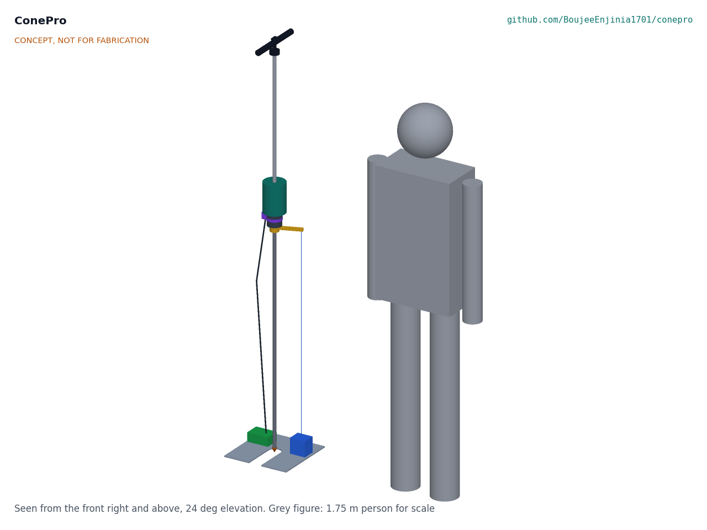
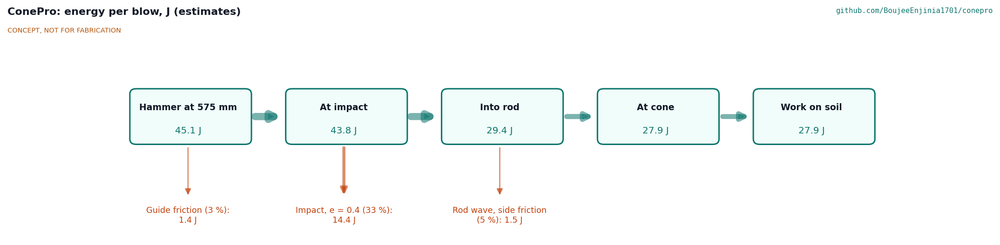
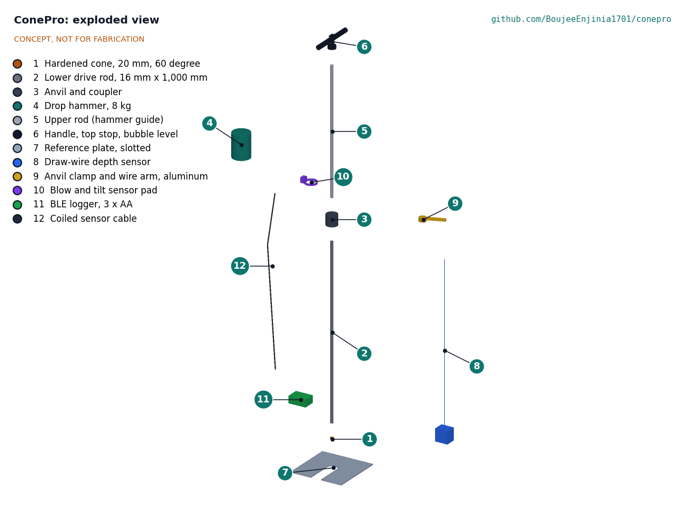

# ConePro design precis

ConePro is a standard-geometry dynamic cone penetrometer (8 kg hammer, 575 mm drop, 20 mm 60 degree cone, as in ASTM D6951) with a draw-wire depth sensor referenced to a plate on the ground, a clamp-on sensor pad at the anvil that detects blows and reads rod tilt, and a small BLE logger, so one person can run a test while the phone plots penetration against blows and exports the record. The sensor set is designed to fit existing standard penetrometers too. The TRL 3 calculations (CNP-CAL-001 v0.3) give about 28 J at the cone per blow, 850 mm of usable penetration per lower rod, about 40 h of logging on three AA cells and $319 in parts, within the $400 budget. With the changes Amish accepted on 2026-09-25 (CNP-DDR-002), the instrument carried in its bag weighs about 15.7 kg (was 16.7 kg) and meets the 16 kg target (R10), and a 500 mm extension rod is a separately carried accessory for tests deeper than 850 mm (R5). On 2026-09-27 Amish decided to keep the 60 mm drum and grow the reel housing to 72 x 60 x 72 mm (CNP-DDR-003), which trims the stroke from 940 mm to 928 mm and still clears the 850 mm usable range. No requirement is now not met; depth accuracy (R2) and shock survival (R11) remain at risk.

*Figure 1. ConePro set up at the start of a test, with a 1.75 m person for scale. The cone tip rests on the ground through the slotted reference plate and the hammer rests on the anvil.*

## How it works

1. **Set up.** The operator lays the slotted reference plate on the ground, stands the cone in the plate's center hole, clamps the draw-wire arm to the rod just below the anvil and straps the sensor pad to the anvil. The app zeroes the depth with the cone point at the surface, and zeroes the tilt by turning the rod half a turn.
2. **Drive.** The operator holds the handle, lifts the 8 kg hammer to the top stop and lets it fall 575 mm onto the anvil. Each blow drives the rod and cone further into the soil.
3. **Sense.** A ring of magnets in the hammer face passes a potted Hall-effect switch in the sensor pad as the hammer lands, and the pad's accelerometer sees the impact peak. A blow counts only when both fire and the depth steps down or holds within 0.5 s. Between blows the accelerometer reads rod tilt. A draw-wire sensor on the plate measures how far the clamp arm has moved down, which equals the cone's penetration because the rod is rigid and the plate stays on the ground surface.
4. **Log.** The logger on the plate reads depth at 100 Hz, waits 0.2 s for the rod and wire to settle after each blow, and stores blow number, depth, tilt and time. It keeps the record even when no phone is connected.
5. **Show.** The phone app plots depth against blows, corrects depth for rod lean, splits the curve into layers of near-constant slope, and gives each layer's DCP index (mm per blow) and an indicative CBR from the ASTM D6951 correlations, with the correlation named on screen. It warns when the rod leans more than 5 degrees. The user exports a CSV with time, location and notes.
6. **Extract.** After the test the operator removes the plate over its slot and pulls the rod out with the optional lever rod puller, which is carried separately. For tests deeper than 850 mm the operator adds the optional 500 mm extension rod and the app re-zeroes. In stiff ground where the lever will not free the rod, the user guidance follows the disposable-cone practice: drive a disposable cone that stays in the ground, so the rod comes out through a hole slightly larger than itself (CNP-DDR-002, D12).

*Figure 2. Energy per blow from hammer to soil, in joules (estimates from CNP-CAL-001, section B). The impact loss depends on the restitution between hammer and anvil, which is assumed, not measured.*

## Main components

Numbers match the exploded view (Figure 3) and `bom/bom.csv`. Geometry is in the parametric model `cad/src/model.py` and on drawing CNP-DWG-001.

| # | Component | Choice | Notes |
| --- | --- | --- | --- |
| 1 | Cone | Hardened steel, 20 mm base, 60 degree point, threaded onto the rod | Replaceable; a worn cone biases results |
| 2 | Lower drive rod | 16 mm steel, 1,000 mm, engraved every 10 mm | Engraving is a manual backup scale and the calibration reference |
| 3 | Anvil and coupler | Steel, 64 mm diameter x 60 mm, threaded between the rods | Plain; the sensor pad clamps on (D3) |
| 4 | Drop hammer | 8.0 kg steel, 100 mm OD x 22 mm bore x 136.4 mm | Sixteen 8 x 4 mm magnets in the lower face |
| 5 | Upper rod (hammer guide) | 16 mm steel, 729 mm | Gives the 575 mm free drop to the stop |
| 6 | Handle and top stop | 26 mm tube T-handle, 44 mm stop collar, bubble level | Level is the tilt backup (D1) |
| 7 | Reference plate | 300 x 300 x 6 mm aluminum, 60 mm center hole and slot | Depth reference on the ground surface; 6 mm to save mass (D9) |
| 8 | Draw-wire depth sensor | 60 mm grooved aluminum drum, single layer, constant-force spring, 12-bit angle sensor, groove keeper, preloaded eye spring | Drum must be metal for thermal stability; bought industrial sensor is the fallback |
| 9 | Anvil clamp and wire arm | Aluminum split collar on the lower rod, arm about 115 mm to the wire eye | Wire exit on the plate 105 mm from the rod; aluminum to save mass (D9) |
| 10 | Blow and tilt sensor pad | Hall switch and 3-axis accelerometer, potted, on a 300 Hz elastomer isolator, band clamp for 50 to 80 mm anvils | Top 8 mm below the anvil top, under the hammer overhang |
| 11 | BLE logger | Microcontroller with BLE, 4 MB flash, button and LED, three AA cells, IP65 box | Kept on the plate, away from impacts |
| 12 | Coiled sensor cable | Pad to logger, with a strain relief at each end | Follows the rod down during the test |
| 15 | Rod extraction lever (optional) | Lever puller with a self-gripping 16 mm rod clamp, about 10:1, about 3 kg | Carried separately; outside the R13 total (D2) |
| 16 | Extension rod (optional) | 16 mm steel, 500 mm, engraved every 10 mm, 0.79 kg | Carried separately with the lever; outside the R10 mass and R13 total (D10) |

*Figure 3. Exploded view with numbered callouts matching the BOM. The carry bag, hardware and the optional extraction lever and extension rod are not shown.*

## Key numbers

All values are estimates from CNP-CAL-001; the bracketed tag names the line of `docs/04-calcs/sizing.py` that prints each one.

*Table 1. Blow energy and timing.*

| Quantity | Estimate | Basis |
| --- | --- | --- |
| Potential energy per blow | 45.1 J [B1] | 8.0 kg x 9.81 m/s² x 0.575 m |
| Impact speed; fall time | 3.36 m/s; 0.342 s [B1] | Free fall over 575 mm |
| Energy reaching the cone | 28.0 J, 62 % (26.0 to 31.2 J) [B4] | 3 % guide friction; Hiley impact efficiency with restitution 0.4 (0.2 to 0.6) and 5.12 kg driven mass; 5 % rod and side friction |
| Mean dynamic soil resistance | 1.9 kN at 15 mm per blow; 14.0 kN at 2 mm per blow [B6] | Energy at the cone over penetration |
| Blow rate | 17 to 24 per minute | One blow every 2.5 to 3.5 s (assumed) |

**What the numbers mean for the user.** The ASTM D6951 correlation for most soils is CBR = 292 / DCP^1.12, with DCP in mm per blow (separate correlations apply to lean clays below CBR 10 and to fat clays). Table 2 shows how sharply the indicative CBR changes at small penetrations, which is why depth accuracy matters most in stiff layers.

*Table 2. Indicative CBR from the ASTM D6951 general correlation [E7].*

| DCP index (mm per blow) | 2 | 5 | 10 | 15 | 25 | 50 |
| --- | --- | --- | --- | --- | --- | --- |
| Indicative CBR (%) | 134 | 48 | 22 | 14 | 8 | 4 |

*Table 3. Depth measurement.*

| Quantity | Estimate | Requirement |
| --- | --- | --- |
| Resolution | 0.046 mm per count [E1] | R2 resolution met |
| Bench error over 1,000 mm, vertical rod | ±0.98 mm worst case; ±0.49 mm root sum square [E3] | R2 (±1 mm) at risk |
| Extra error from rod lean at 850 mm, after tilt correction | 1.07 mm at 1 degree; 2.02 mm at 2 degrees [E4] | Why the usable range stops at 850 mm (accepted, D11) |
| DCP index error, 10 blows at 2 mm per blow | ±4.9 % RSS (±9.8 % worst); CBR ±5.5 % [E8] | |
| Wire slack after a blow | 1.9 to 17 mm for 5 to 35 ms [E5] | Groove keeper and preloaded eye spring needed |
| Record latency | 0.21 s after impact [E6] | R4 met |
| Plate settlement or heave | Not calculable; static pressure only 0.24 kPa [E9] | Open question |

*Table 4. Range, mass, time, shock and power.*

| Quantity | Estimate | Requirement |
| --- | --- | --- |
| Stroke per lower rod | 928 mm, limited by the wire arm meeting the reel housing (72 x 60 x 72 mm round the 60 mm drum, CNP-DDR-003); 850 mm usable [D1, D2]; optional 500 mm extension rod [C7] | R5 (restated, D10) met |
| Assembled height | 1,867 mm [A3] | |
| Mass as carried in the bag | 15.7 kg (was 16.7 kg); 15.3 kg without the bag [C2, C6] | R10 (16 kg) met, thin |
| Heaviest piece | 9.82 kg, hammer captive on the upper rod [C3] | R10 (10 kg) met |
| Packed length | About 1.08 m (longest piece 1,022 mm) [C4] | R10 met |
| Reference test time | 8.1 to 11.7 min [J1] | R9 met, thin |
| Shock at the anvil; at the isolated pad | 1,400 to 5,500 g mean; about 543 g [G1, G2] | R11 at risk |
| Tilt reading | ±0.3 degree after rotation zeroing [H1] | R6 met by design |
| Average current; battery life | 50.2 mA; 40 h, 20 h at 0 °C [K1, K2] | R12 met |
| Storage | About 830 tests in 4 MB [I1] | R8 met |

*Table 5. Cost [L1].*

| Group | Indicative cost |
| --- | --- |
| Mechanical DCP (items 1 to 7) | $170 |
| Sensing and logging (items 8 to 12) | $104 |
| Carry bag, hardware and consumables (items 13, 14) | $45 |
| **Instrument total** | **$319** (R13, $400, met) |
| Optional extraction lever (item 15) and extension rod (item 16) | $50 and $15, outside the instrument total |

## Key design choices

Amish decided the TRL 2 review items on 2026-09-25 by accepting every recommendation (CNP-DDR-001). The choices below are therefore decided, not proposed.

- **ASTM D6951 geometry (D5).** The standard 8 kg hammer and 575 mm drop, so users can apply published correlations and compare with existing DCP data. The 4.6 kg option is noted for later.
- **Depth by draw-wire from a ground plate (D4).** A draw-wire reel on the plate measures the clamp arm's movement. A laser time-of-flight sensor is the fallback to compare later. TRL 3 adds three details to meet the calculations: a metal, single-layer grooved drum; a groove keeper for the slack after each blow; and a preloaded spring at the arm eye to limit the snap tension.
- **Blow detection by Hall sensor with cross-checks (D6).** A blow counts when the Hall switch sees the hammer arrive, the accelerometer sees an impact peak and the depth steps down or holds within 0.5 s. A peak below half the full-drop value flags a short drop.
- **Tilt by accelerometer, with a bubble level as backup (D1).** The accelerometer in the sensor pad reads tilt between blows, and the app warns above 5 degrees and corrects depth for lean.
- **Electronics on the plate (D7).** Only the isolated sensor pad sees impacts.
- **Three AA cells (D8).** No lithium safety or shipping issues; sold everywhere.
- **Optional lever for extraction (D2).** A lever puller with a rod clamp, carried separately and outside the instrument cost and mass.
- **Sensor set fits standard DCPs (D3).** The clamp, band-mounted pad, plate and reel need no machining of the penetrometer (R15). The prototype is a complete instrument.

The TRL 3 calculations raised four further items, which Amish decided on 2026-09-25 by accepting every recommendation (CNP-DDR-002):

- **Lighter carried set (D9).** A 6 mm aluminum plate (1.29 kg, was 1.72 kg), an aluminum clamp and arm (0.12 kg, was 0.34 kg) and a 0.40 kg nylon roll bag (was 0.80 kg) bring the carried mass from 16.7 kg to 15.7 kg, within R10.
- **Extension rod as an accessory (D10).** R5 is restated as 850 mm per lower rod. A 500 mm extension rod is carried separately with the lever for deeper tests.
- **Reel details accepted (D11).** The metal single-layer grooved drum, groove keeper and preloaded eye spring stay in BOM line 8, and the usable range stays at 850 mm per rod. The bought industrial draw-wire sensor remains the fallback.
- **Stiff ground (D12).** No hardware change; the user guidance states the disposable-cone practice for ground where the lever cannot free the rod.

## Safety

> **Safety:** ConePro drops an 8 kg steel hammer onto a steel anvil every few seconds and drives a pointed steel rod into the ground. Treat buried services, crushed fingers, flying fragments, noise, back strain and misuse of the results as hazards at every test point.

- **Buried services.** A rod driven 1 m into the ground can strike electric cables, gas pipes and water mains. Get a utility locate before every test (in the United States, call 811 or use the state one-call service) and do not test within the marked tolerance zone.
- **Crushed fingers and hands.** The hammer lands with about 44 J. Keep hands on the handle only, never on the anvil, the hammer's lower face, the sensor pad or the clamp arm. The pad sits 8 mm under the hammer overhang, which is a pinch point: fit and remove it only with the hammer held at the top stop or removed.
- **Flying fragments and mushrooming.** Repeated steel-on-steel impact at thousands of g can chip the anvil or hammer face and spall hardened steel. Wear safety glasses, inspect the faces, and replace them when they mushroom or crack.
- **Magnets.** The hammer carries sixteen strong magnets. Keep it away from pacemakers and other implanted devices, and from cards and instruments that magnets can damage.
- **Draw-wire.** A wire that breaks or is released under tension can whip. Keep faces away from the reel and never let the arm snap back.
- **Noise.** Steel-on-steel impact is loud at close range. Hearing protection is recommended; the level is not yet estimated.
- **Lifting and posture.** The hammer is lifted about 57 times per test and the upper assembly weighs about 9.8 kg. Use a straight back and swap operators on long test days. Pull the rod only with the lever, never by back strength; stop if the lever will not move it (the pull force can exceed 3 kN in stiff ground), and use a disposable cone for further tests at that site (D12).
- **Rod whip and tipping.** A leaning rod can bend or kick sideways when struck. Stop when the app warns of lean (R6).
- **Sharp cone.** Cover the cone in transport.
- **Ground and site hazards.** Contaminated land, trench edges and traffic: follow site rules and do not test at the edge of an open excavation.
- **Misuse of results.** CBR values are indicative correlations. ConePro results must not be used on their own to design foundations or to decide that ground is safe to build on; they show where a qualified geotechnical engineer should investigate.
- **Batteries.** Alkaline AA cells carry little risk; remove them for storage to avoid leakage.

## Open questions

- Choose the first co-design partner and site types (proposed, awaiting Amish; partners to be picked per area later).
- Measure the restitution, the magnet field with the steel hammer, the isolator response and the draw-wire error on a bench.
- Estimate plate settlement or heave under blows, and how to detect it (for example a second reference point).
- Define the blow and depth data format and the layer-splitting method; check against ORN 8 practice.
- Confirm commercial prices for instrumented penetrometers (not yet checked online).

Concept media: [blueprint sheet](../media/concept-blueprint.pdf), [interactive 3D model](../media/viewer.html). General arrangement: [CNP-DWG-001](../cad/drawings/CNP-DWG-001.pdf).
