# ConePro prototype build plan

**Plan, not yet built.** How to build the first proof-of-concept prototype, component by component. Building and testing to it is TRL 4 work. Decisions still to be made are kept in the design decisions register ([docs/06-design-decisions.md](06-design-decisions.md)), not here.

## 1. What you are building

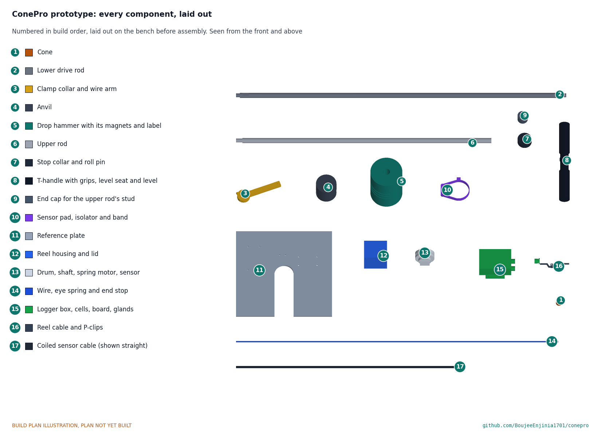

*Figure 1. Every component laid out on the bench and numbered in build order.*

The prototype is a complete dynamic cone penetrometer with its sensor set: a hardened cone and a 1 m steel drive rod, a steel anvil, an 8 kg drop hammer sliding on an upper rod with a stop collar and a T-handle, and, on a slotted aluminium plate that lies on the ground, a draw-wire reel that measures how far the rod has gone down and a small logger box. A sensor pad strapped to the anvil counts the blows and reads the rod's lean. Figure 1 shows the 16 components in the order you make or fit them. Twelve are made in a small workshop: the cone, both rods, the anvil, the hammer, the stop collar, the T-handle, the clamp and arm, the reference plate, the printed reel housing and pad, and the turned drum; the bought logger box is drilled. The rest are bought and fitted: the bearings, spring motor and sensor boards, the wire, the band clamp, the cables, glands and fixings. The work is lathe turning and threading, sawing, drilling and tapping steel and aluminium, one welding job (the handle), two 3D prints, and wiring bought modules. The parts cost about $335 from the bill of materials.

> **Safety:** The finished instrument drops an 8 kg hammer 575 mm onto a steel anvil. Keep fingers off the anvil, the hammer face and the sensor pad whenever the hammer is on the rod, and never stand the upper rod on its end with the hammer free to slide off. The hammer carries sixteen strong magnets: keep it away from pacemakers and other implanted devices. Hardened steel can chip: wear safety glasses for turning, drilling and every test blow. Welding needs a welding screen, gloves and a clear, ventilated space, or have a local shop do it.

## 2. What changed to make it buildable

The concept showed what ConePro does; some of its parts could not be made or joined as drawn. Each change below keeps what the instrument does, and all of them are recorded in decision record CNP-DDR-004, open for Amish's review.

*Table 1. Changes from the concept.*

| Component | The concept had | The buildable design has | Why |
| --- | --- | --- | --- |
| Cone | A 5 mm parallel shoulder above the point | A 12 mm shoulder with an M12 tapped hole (Figure 2) | Room for the thread; the 20 mm, 60° point is unchanged |
| Rod joints | Plain rod ends meeting the cone and anvil | M12 studs on the rod ends, tapped holes in the cone and anvil, each seated on a square shoulder (Figures 3 and 6) | Blows pass through the shoulders; one thread size throughout |
| Stop collar and handle | A collar and handle stem overlapping the rod, with no fixing | The upper rod runs through the collar (roll pin) and through the handle tube (welded) (Figures 12 and 14) | The drop is set on the real hammer before pinning |
| Bubble level | A block resting on the round handle tube | A bullseye level bonded in a seat welded to the rod top (Figure 14) | Sits square on the rod axis |
| Hammer magnets | No defined position, in the striking face | Pockets on an 82 mm circle, outside the anvil strike area, 0.5 mm below the face (Figure 9) | The magnets are never struck |
| Clamp and wire arm | An arm through the rod, joined to nothing, and a collar held only by friction | One piece cut from 12 mm plate, its top butting the anvil underside (Figures 5 and 6) | The anvil carries it at every blow |
| Sensor pad and band | A band running through a flat pad | A curved pad on a curved isolator, with the band over the pad (Figure 16) | Full contact; a stock band clamp |
| Draw-wire reel | A solid block, drum under the exit | Housing, lid, drum, shaft, spring motor and sensor, with the drum's edge under the exit (Figures 21 and 22) | The wire leaves the drum straight up |
| Reel and logger | No fixing to the plate | Screws from below into the reel; a flanged logger box screwed down (Figures 20 and 26) | The plate still lies flat |
| Wiring | No cable from the reel to the logger; no cable entries | A reel-to-logger cable in two P-clips; two glands in the logger (Figures 25 and 26) | The depth sensor can reach the logger; IP65 entries |

## 3. Making the components

Make and check each component before the assembly step that needs it. Sizes are in millimetres. Lathe tolerance is 0.1 mm and workshop tolerance 0.5 mm unless a step says otherwise; drawings do not carry tolerances before TRL 4. On the plate, positions are measured from its centre: "X" toward the reel side, "Y" away from the slot.

### 3.1 Cone (make 2, one spare)

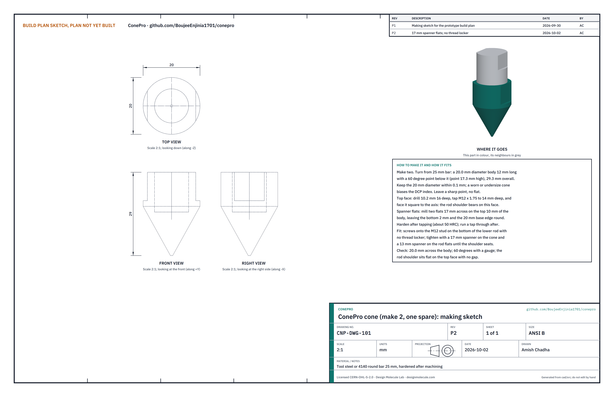

*Figure 2. Cone making sketch (CNP-DWG-101).*

**What it is and what it is made from.** The hardened point that is driven into the soil. Tool steel or 4140 class round bar 25 mm, hardened after machining.

**How to make it.**

1. Turn a 20.0 mm diameter body 12 mm long with a 60° point below it; the point is 17.3 mm high and the cone 29.3 mm overall. Leave a sharp point.
2. Face the top square to the axis: the rod's shoulder bears on it.
3. Drill 10.2 mm 16 mm deep in the top face and tap M12 x 1.75 to 14 mm deep.
4. Harden to about 50 HRC, then run the tap through again.

**How it fits the parts next to it.**

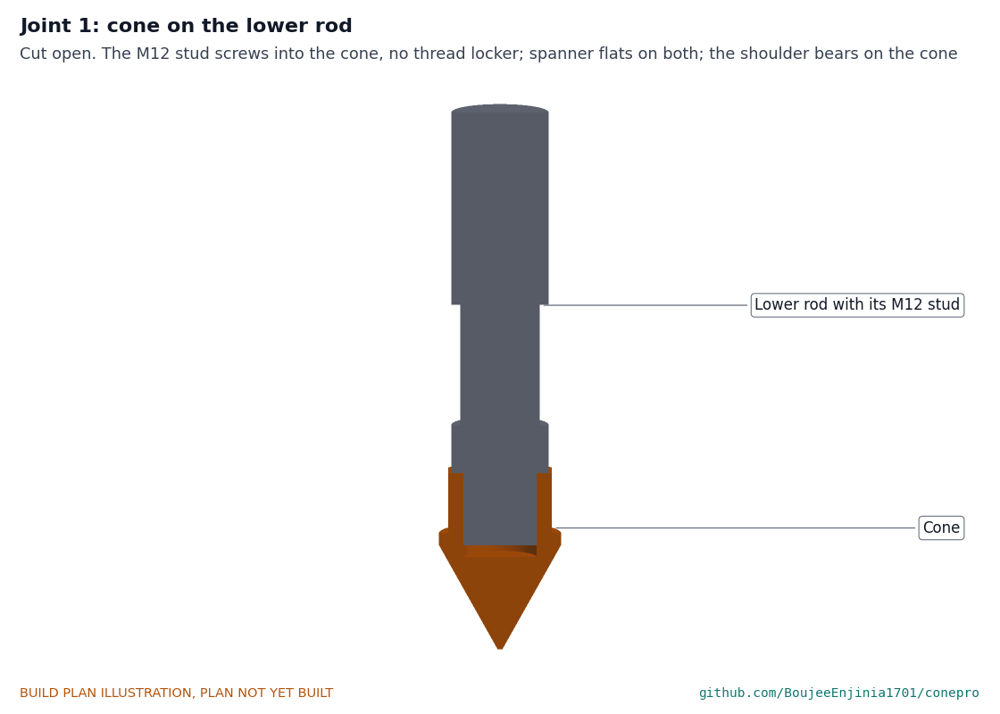

*Figure 3. The rod's 12 mm stud screws into the cone; the rod's shoulder seats on the cone's top face.*

The cone screws onto the bottom stud of the lower rod with medium thread locker until the shoulder seats. A 2 mm gap is left at the bottom of the tapped hole, so the shoulder, not the stud, carries the blows.

**Check before moving on.** 20.0 mm across the body; 60° against a gauge; the rod shoulder sits flat on the cone with no visible gap.

### 3.2 Lower drive rod

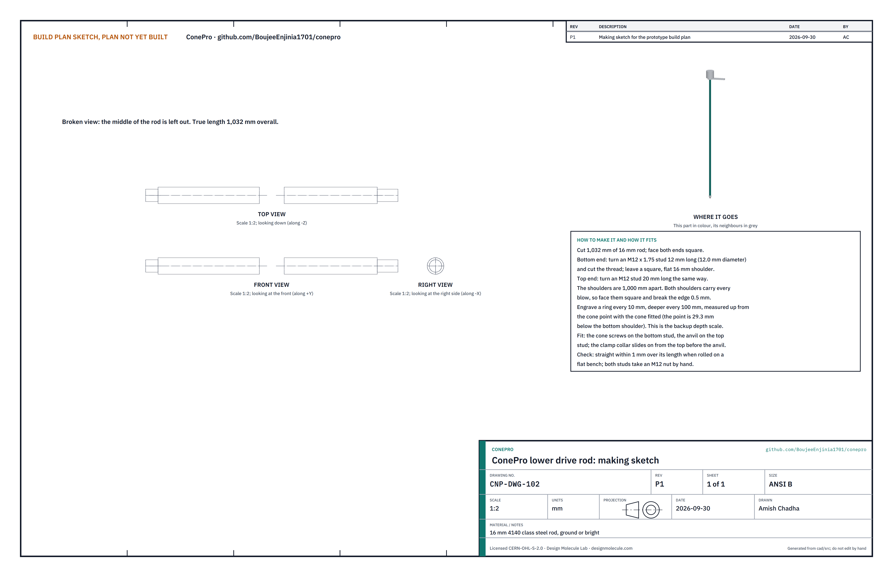

*Figure 4. Lower drive rod making sketch (CNP-DWG-102), drawn broken; it is 1,032 mm overall.*

**What it is and what it is made from.** The 1 m rod that carries the blows from the anvil to the cone. 16 mm steel rod, 4140 class, ground or bright.

**How to make it.**

1. Cut 1,032 mm and face both ends square.
2. Turn an M12 x 1.75 stud 12 mm long on the bottom end and one 20 mm long on the top end, each with a square, flat shoulder; the shoulders are 1,000 mm apart. Break the shoulder edges 0.5 mm.
3. Engrave a ring every 10 mm, deeper every 100 mm, measured up from the cone point with the cone fitted (the point is 29.3 mm below the bottom shoulder). This is the backup depth scale and the calibration reference.

**How it fits the parts next to it.** The cone screws onto the bottom stud (Figure 3), the anvil onto the top stud (Figure 6). The clamp collar slides on from the top before the anvil goes on.

**Check before moving on.** Straight within 1 mm when rolled on a flat bench; both studs take an M12 nut by hand.

### 3.3 Clamp collar and wire arm

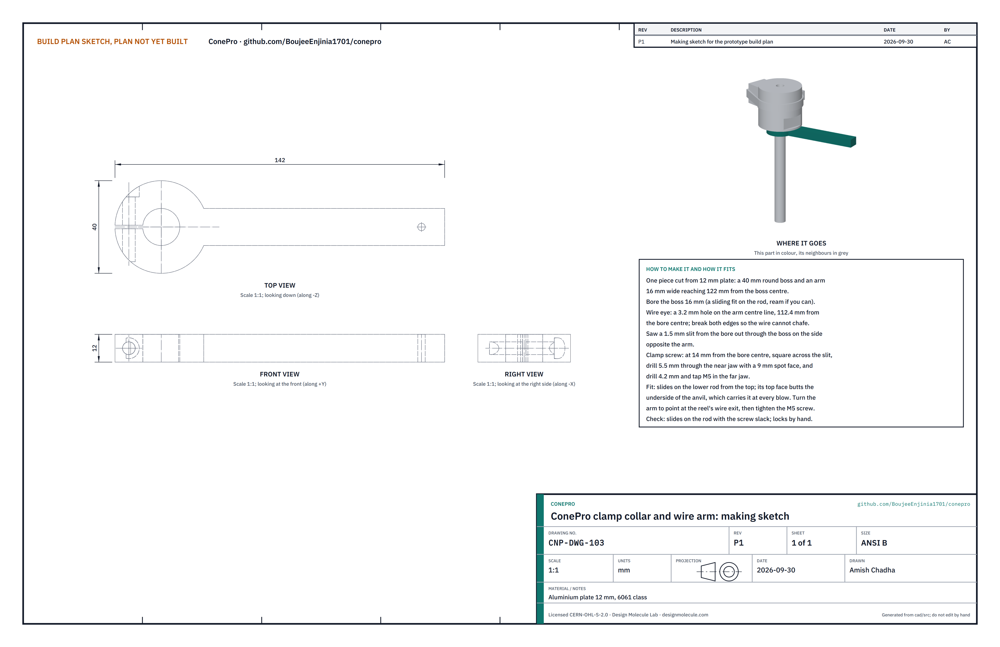

*Figure 5. Clamp collar and wire arm making sketch (CNP-DWG-103).*

**What it is and what it is made from.** The arm that the draw wire pulls on: it goes down with the rod, so the wire measures the cone's penetration. One piece of 6061 class aluminium plate 12 mm thick.

**How to make it.**

1. Mark out a 40 mm round boss and an arm 16 mm wide reaching 122 mm from the boss centre. Cut it out with a bandsaw or jigsaw and file to the lines.
2. Bore the boss 16 mm, a sliding fit on the rod (ream if you can).
3. Drill the 3.2 mm wire eye on the arm's centre line, 112.4 mm from the bore centre, and round both edges of the hole so the wire cannot chafe.
4. Saw a 1.5 mm slit from the bore out through the boss on the side opposite the arm.
5. Clamp screw: 14 mm from the bore centre and square across the slit, drill 5.5 mm through the near jaw with a 9 mm spot face for the head, then drill 4.2 mm and tap M5 in the far jaw. Fit an M5 x 25 socket screw.

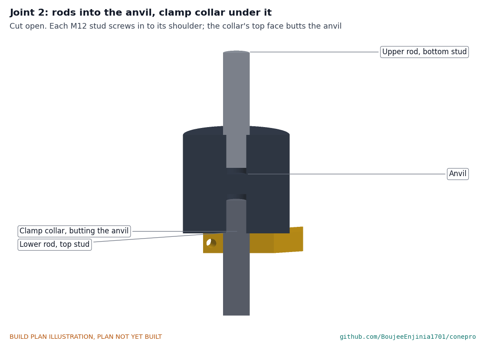

*Figure 6. The collar's top face butts the underside of the anvil.*

**How it fits the parts next to it.** The collar slides onto the lower rod from the top and is pushed up against the anvil's underside, which carries it at every blow. Turn the arm until its eye is straight above the reel's wire exit, then tighten the M5 screw.

**Check before moving on.** The collar slides on the rod with the screw slack and locks by hand with it tight.

### 3.4 Anvil

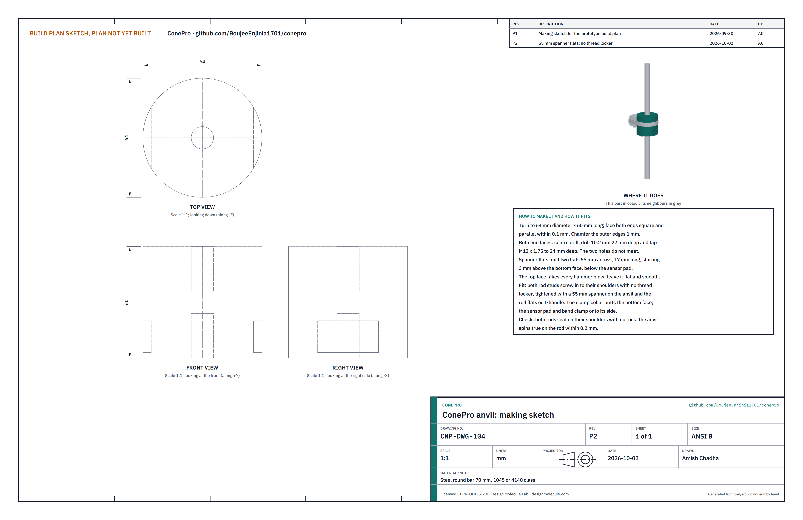

*Figure 7. Anvil making sketch (CNP-DWG-104).*

**What it is and what it is made from.** The steel block the hammer strikes; it also joins the two rods. 1045 or 4140 class round bar 70 mm.

**How to make it.**

1. Turn to 64 mm diameter x 60 mm; face both ends square and parallel within 0.1 mm; chamfer the outer edges 1 mm.
2. In both end faces, centre drill, drill 10.2 mm 27 mm deep and tap M12 x 1.75 to 24 mm deep. The two holes do not meet.

**How it fits the parts next to it.** The lower rod's top stud screws into the bottom hole and the upper rod's stud into the top hole, each to its shoulder with medium thread locker (Figure 6). The clamp collar butts the bottom face; the sensor pad and band clamp onto the side.

**Check before moving on.** Both rods seat on their shoulders with no rock; the anvil spins true on the rod within 0.2 mm.

### 3.5 Drop hammer

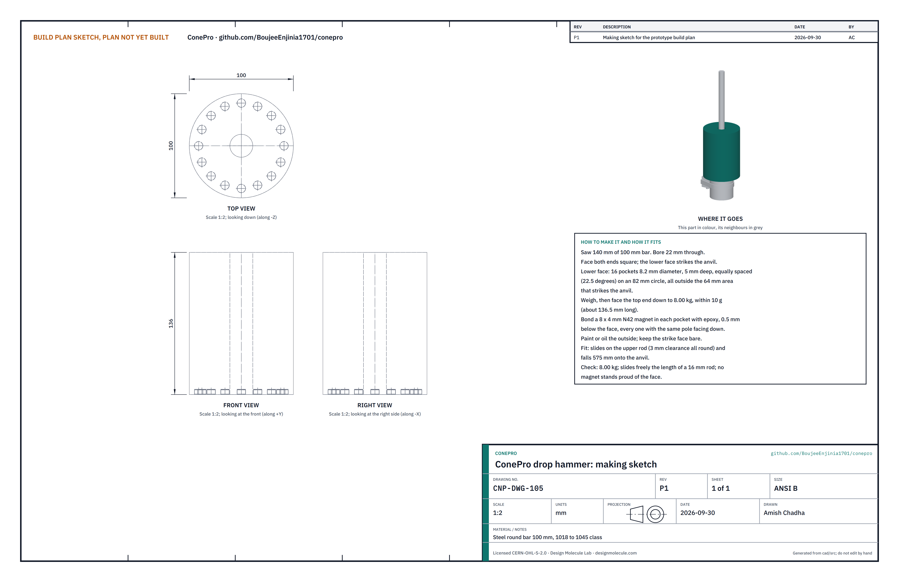

*Figure 8. Drop hammer making sketch (CNP-DWG-105).*

**What it is and what it is made from.** The 8.00 kg weight that is lifted and dropped 575 mm onto the anvil. 1018 to 1045 class round bar 100 mm, with sixteen 8 x 4 mm N42 disc magnets.

**How to make it.**

1. Saw 140 mm of bar and bore 22 mm through.
2. Face both ends square. The lower face strikes the anvil.
3. In the lower face, cut sixteen pockets 8.2 mm diameter and 5 mm deep, equally spaced (22.5° apart) on an 82 mm circle. They all lie outside the 64 mm area that strikes the anvil.
4. Weigh it, then face the top end down until it weighs 8.00 kg within 10 g (about 136.5 mm long).
5. Bond a magnet in each pocket with epoxy, 0.5 mm below the face, every one with the same pole facing down. Mark that pole.
6. Paint or oil the outside; leave the strike face bare.

**How it fits the parts next to it.** It slides on the upper rod with 3 mm clearance all round and lands on the anvil's top face. As it lands, the magnets pass over the sensor pad:

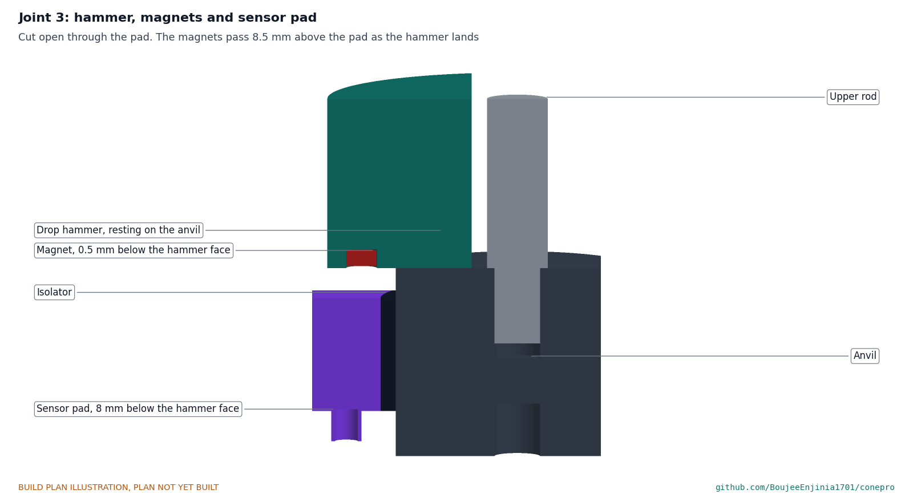

*Figure 9. The magnets sit 8.5 mm above the pad's top face when the hammer rests on the anvil.*

**Check before moving on.** 8.00 kg; slides freely along a 16 mm rod; no magnet stands proud of the face.

### 3.6 Upper rod

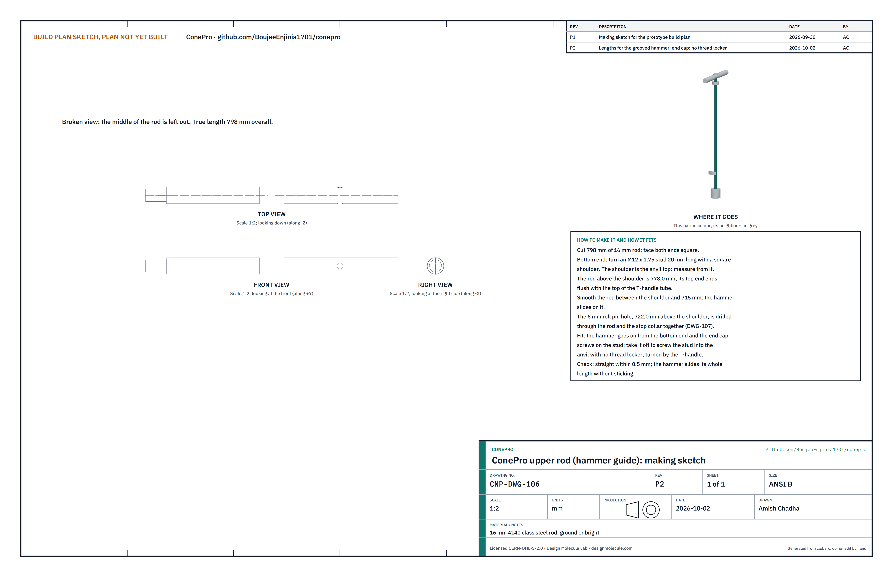

*Figure 10. Upper rod making sketch (CNP-DWG-106), drawn broken; it is 796 mm overall.*

**What it is and what it is made from.** The rod the hammer slides on; it carries the stop collar and the handle. 16 mm steel rod, 4140 class.

**How to make it.**

1. Cut 796 mm and face both ends square.
2. Turn an M12 x 1.75 stud 20 mm long on the bottom end with a square shoulder. Measure everything from this shoulder: it sits on the anvil.
3. Smooth the rod from the shoulder up to 715 mm, where the hammer slides.
4. The 6 mm pin hole, 720.5 mm above the shoulder, is drilled later through rod and collar together (section 3.7).

**How it fits the parts next to it.** The hammer goes on from the bottom end, then the stud screws into the anvil (Figure 6). The top end passes through the handle tube and ends flush with its top (Figure 14).

**Check before moving on.** Straight within 0.5 mm; the hammer slides its whole working length without sticking.

### 3.7 Top stop collar

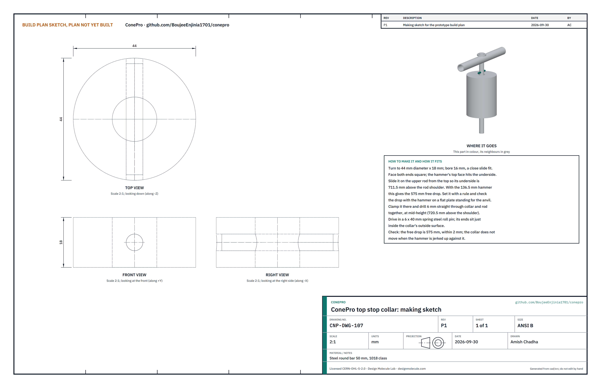

*Figure 11. Top stop collar making sketch (CNP-DWG-107).*

**What it is and what it is made from.** The collar the hammer is lifted up to; it sets the 575 mm drop. 1018 class round bar 50 mm and a 6 x 40 mm spring steel roll pin.

**How to make it.**

1. Turn to 44 mm diameter x 18 mm and bore 16 mm, a close slide fit on the rod. Face both ends square.
2. Slide it onto the upper rod from the top so its underside is 711.5 mm above the rod's shoulder: the 136.5 mm hammer plus the 575 mm drop. Check the drop with the hammer on the rod and the shoulder standing on a flat plate.
3. Clamp it there and drill 6 mm straight through collar and rod together at its mid-height, 720.5 mm above the shoulder.
4. Drive in the roll pin; its ends sit just inside the collar's outside surface.

**How it fits the parts next to it.**

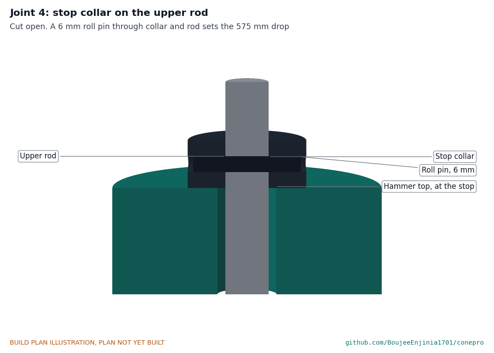

*Figure 12. The roll pin passes through collar and rod; the hammer's top face stops against the collar's underside.*

**Check before moving on.** The free drop is 575 mm within 2 mm; the collar does not move when the hammer is jerked up against it.

### 3.8 T-handle, level seat and bubble level

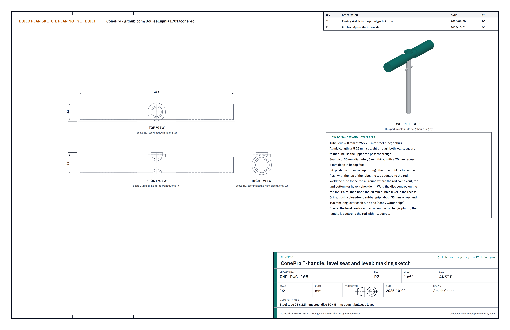

*Figure 13. T-handle, level seat and level making sketch (CNP-DWG-108).*

**What it is and what it is made from.** The handle the operator holds, and the backup level that shows when the rod is plumb. Steel tube 26 x 2.5 mm, a 30 x 5 mm steel disc and a bought 20 mm bullseye level.

**How to make it.**

1. Cut 260 mm of tube and deburr it. At mid-length drill 16 mm straight through both walls, square to the tube.
2. Turn the seat disc 30 mm diameter and 5 mm thick with a 20 mm recess 3 mm deep in its top face.
3. Push the upper rod (with the stop collar already pinned) up through the tube until its top end is flush with the top of the tube and the tube is square to the rod.
4. Weld the tube to the rod all round where the rod comes out, top and bottom, or have a local shop do it. Weld the disc centred on the rod top.
5. Paint, fit push-in caps in the tube ends, then bond the level in the recess.

**How it fits the parts next to it.**

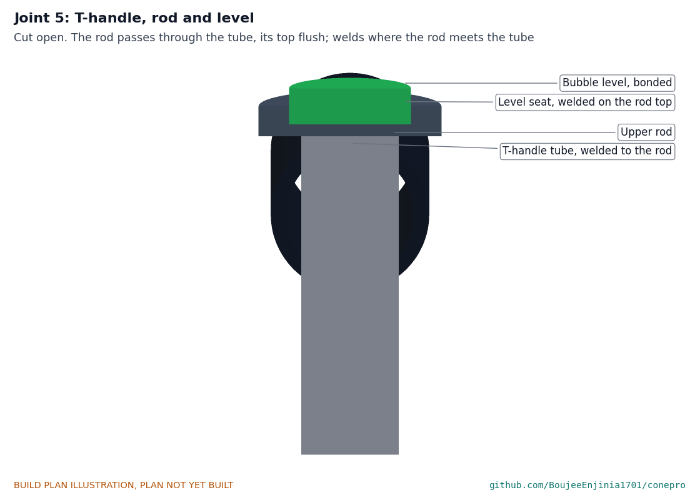

*Figure 14. The rod passes through the tube, its top flush; the seat sits on the rod top and the level in the seat.*

**Check before moving on.** With the rod hanging plumb the level reads centred; the handle is square to the rod within 1°.

### 3.9 Sensor pad and isolator

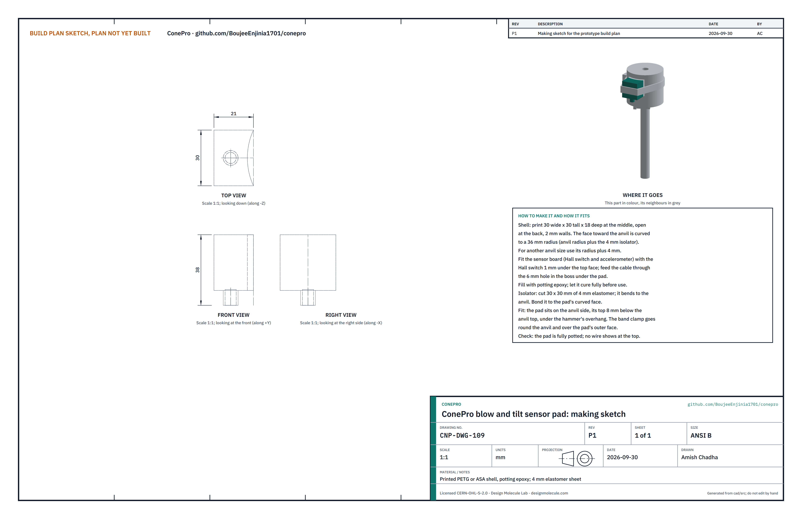

*Figure 15. Blow and tilt sensor pad making sketch (CNP-DWG-109).*

**What it is and what it is made from.** A small potted block on the side of the anvil: its Hall switch counts the blows as the hammer's magnets pass over it, and its accelerometer reads the impact and the rod's lean. A printed PETG or ASA shell, potting epoxy, the bought sensor board, a 4 mm elastomer sheet and a 12 mm stainless worm-drive band clamp.

**How to make it.**

1. Print the shell 30 wide x 30 tall x 18 deep at the middle, open at the back, with 2 mm walls. The face toward the anvil is curved to a 36 mm radius (the anvil radius plus the 4 mm isolator); for another anvil, use its radius plus 4 mm. A boss underneath has a 6 mm hole for the cable.
2. Fit the sensor board with the Hall switch 1 mm under the top face. Feed the coiled cable's pad end through the boss.
3. Fill with potting epoxy and let it cure fully.
4. Cut 30 x 30 mm of the elastomer sheet and bond it to the curved face.

**How it fits the parts next to it.**

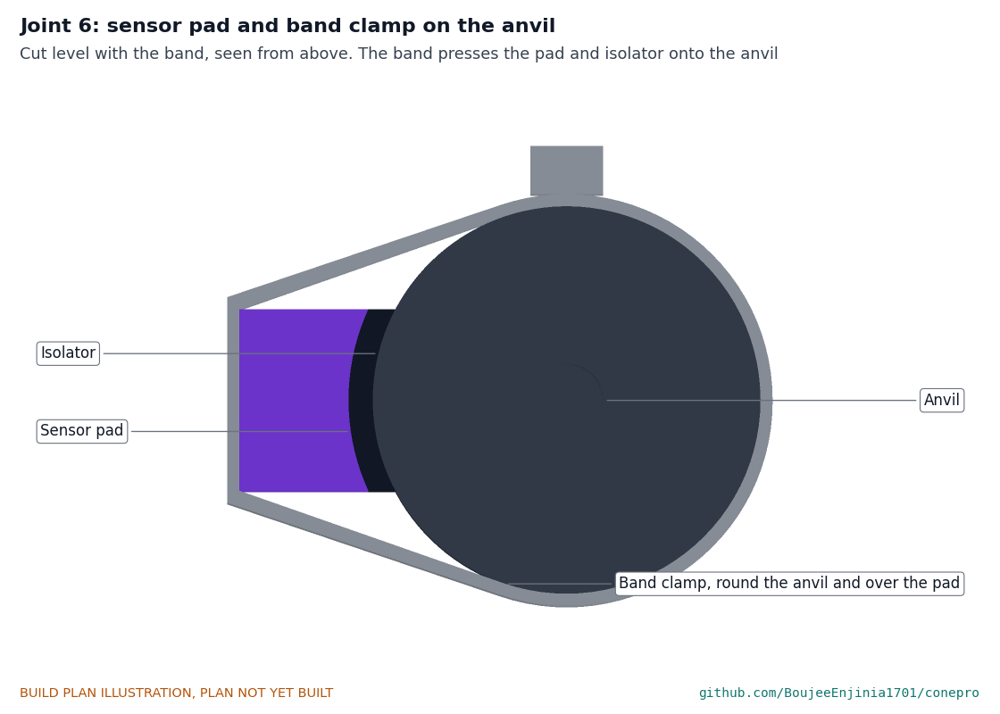

*Figure 16. Seen from above at the band: the band goes round the anvil and over the pad, pressing pad and isolator onto the anvil.*

The pad sits on the side of the anvil opposite the arm, its top 8 mm below the anvil's top face, under the hammer's overhang (Figure 9). The band clamp, about 12 mm wide, goes round the anvil and across the pad's outer face, with its screw housing on the far side.

**Check before moving on.** The pad is fully potted with no wire showing; it does not move when pushed by hand once the band is tight.

### 3.10 Reference plate

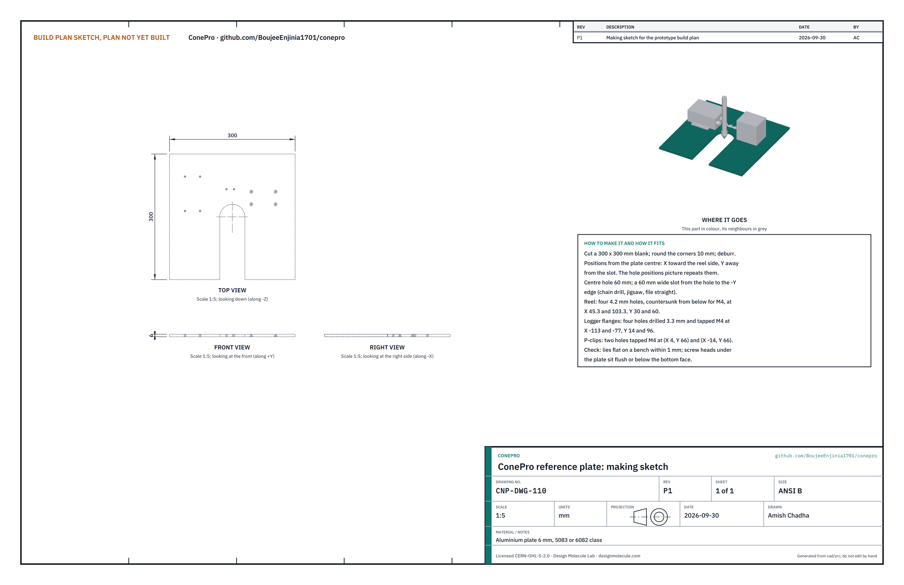

*Figure 17. Reference plate making sketch (CNP-DWG-110).*

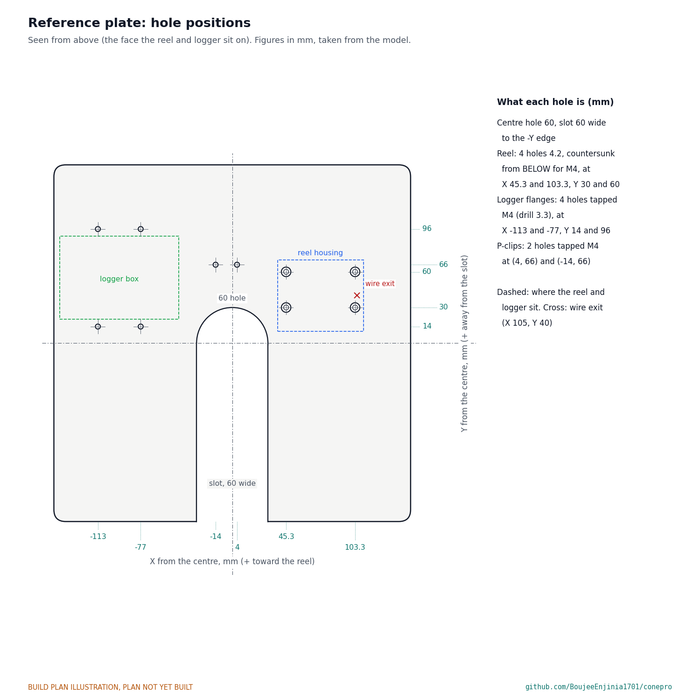

*Figure 18. Every hole, measured from the plate centre.*

**What it is and what it is made from.** The plate that lies on the ground round the rod: the zero for the depth, and the base for the reel and logger. 5083 or 6082 class aluminium plate 6 mm.

**How to make it.**

1. Cut a 300 x 300 mm blank, round the corners to 10 mm, and mark the centre.
2. Cut the 60 mm centre hole and a 60 mm wide slot from the hole to one edge (the -Y edge): chain drill, cut with a jigsaw and file straight.
3. Reel holes: four 4.2 mm holes at X 45.3 and 103.3, Y 30 and 60, countersunk from below for M4 screws.
4. Logger holes: four holes drilled 3.3 mm and tapped M4 at X -113 and -77, Y 14 and 96.
5. P-clip holes: two holes tapped M4 at X 4, Y 66 and X -14, Y 66.
6. Deburr everything.

**How it fits the parts next to it.** The reel and logger sit on its top face (Figures 20 and 26). Its underside lies on the ground, so every screw head underneath must sit flush.

**Check before moving on.** Flat within 1 mm on a bench; the reel housing and logger box line up with their holes.

### 3.11 Reel housing and lid

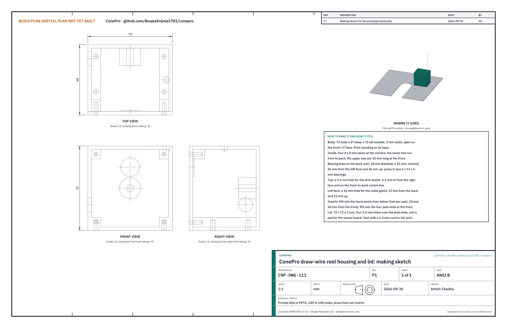

*Figure 19. Draw-wire reel housing and lid making sketch (CNP-DWG-111).*

**What it is and what it is made from.** The box that holds the draw-wire drum and its sensor and keeps rain and dust out. Printed ASA or PETG with solid walls, brass heat-set inserts, two 6 x 13 x 5 mm bearings, a 1.5 mm sealing cord and a pressed-in wire eyelet.

**How to make it.**

1. Print the body 72 wide, 57 deep and 72 tall with 3 mm walls, open on the front face, standing on its base. Inside: an 8 x 8 mm post along each bottom corner, front to back; two short 8 x 8 x 10 mm posts at the top front corners; and an 18 mm bearing boss, 15 mm deep, on the back wall, centred 36 mm from the left face and 36 mm up.
2. Print the lid, 72 x 72 x 3 mm, with four 3.4 mm holes over the post ends and a small pad where the sensor board mounts.
3. Holes in the body: a 5.2 mm hole in the top, 5.3 mm in from the right face and half way back, for the eyelet; a 12 mm hole in the left face, 12 mm from the back and 22 mm up, for the cable gland.
4. Fit heat-set inserts: M4 into the underside of each bottom post, 20 mm and 50 mm from the front; M3 into the four post ends at the front.
5. Press the two bearings into the boss.

**How it fits the parts next to it.**

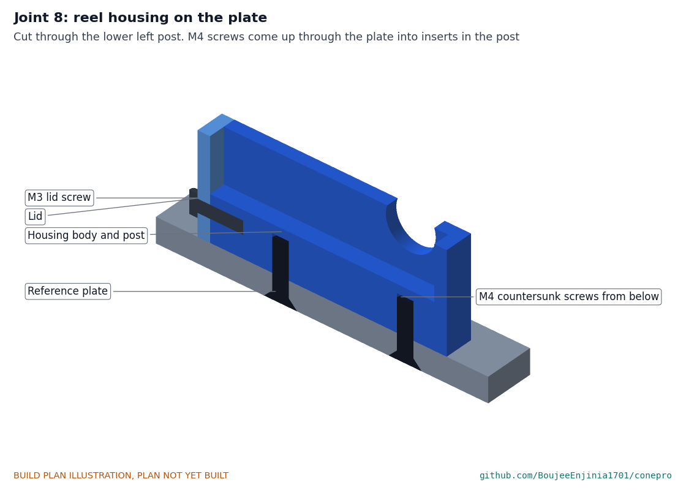

*Figure 20. Cut through the lower left post: the M4 screws come up through the countersunk plate holes into the inserts; the M3 screws hold the lid on.*

**Check before moving on.** The lid seats all round on the sealing cord; the drum shaft turns freely in the bearings.

### 3.12 Drum and the parts inside the reel

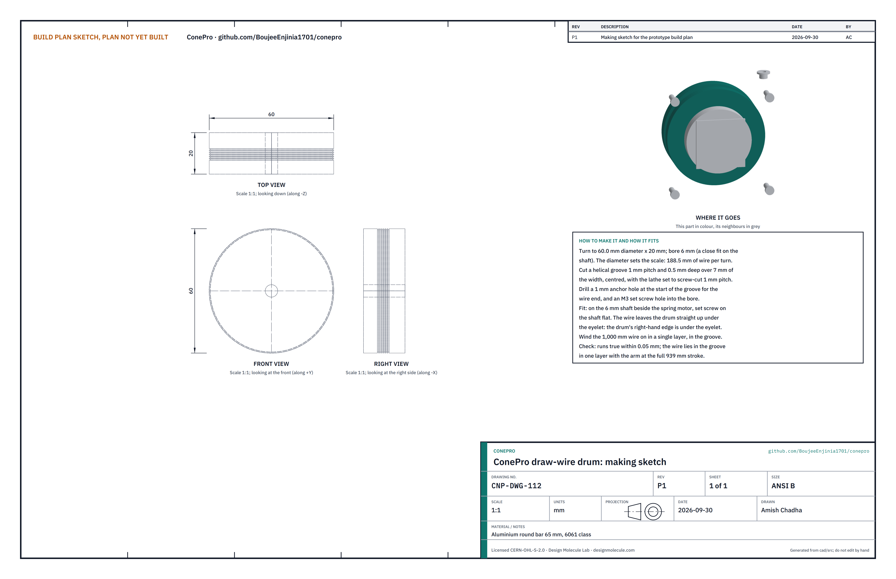

*Figure 21. Draw-wire drum making sketch (CNP-DWG-112).*

**What it is and what it is made from.** The drum the wire winds on: each turn is 188.5 mm of wire, which the angle sensor reads to 0.05 mm. 6061 class aluminium round bar 65 mm, a 6 mm steel shaft, a constant-force spring motor (3 to 5 N), a 6 mm diametric magnet, a 12-bit magnetic angle sensor board and about 1,000 mm of 0.45 mm coated 7x7 steel wire.

**How to make it.**

1. Turn the drum 60.0 mm diameter x 20 mm and bore it 6 mm, a close fit on the shaft. The diameter sets the scale, so hold it to 0.05 mm.
2. Screw-cut a helical groove, 1 mm pitch and 0.5 mm deep, over 7 mm of the width, centred.
3. Drill a 1 mm anchor hole at the start of the groove and an M3 set screw hole into the bore.
4. File a flat on the shaft for the set screw. Fit the spring motor beside the drum and the magnet on the shaft's front end.
5. Anchor the wire and wind it on in one layer, in the groove.

**How it fits the parts next to it.**

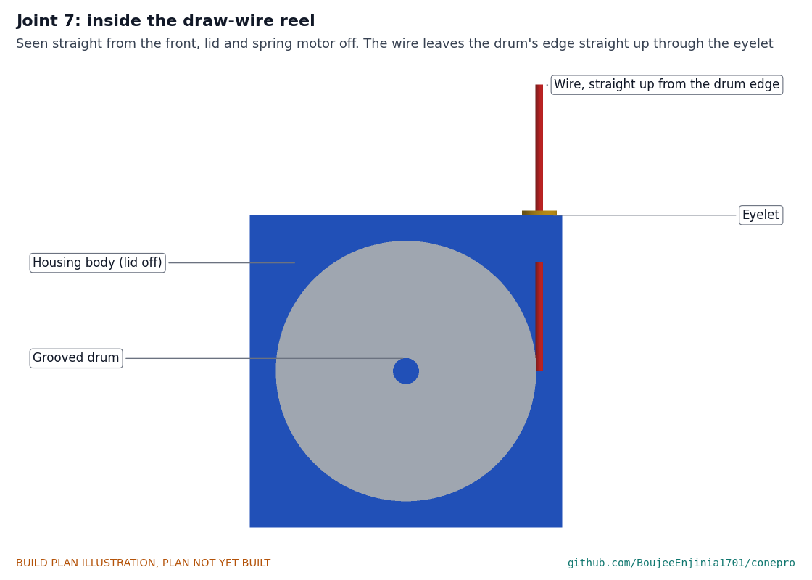

*Figure 22. The drum's right-hand edge sits under the eyelet, so the wire leaves the drum straight up.*

The shaft runs in the two bearings in the back boss; the drum and spring motor sit on it, the magnet faces the sensor board on the lid 1.4 mm away. At the arm, the wire passes up through the eye, through the preloaded spring and into a crimped end stop:

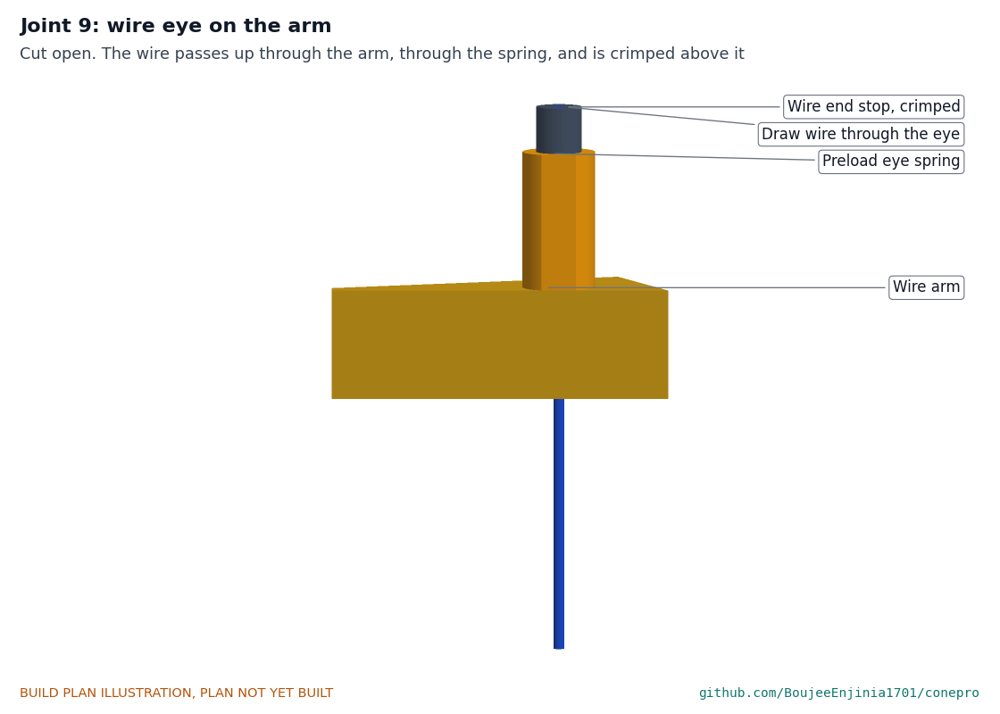

*Figure 23. The spring sits on top of the arm; the end stop is crimped on the wire above it.*

**Check before moving on.** The drum runs true within 0.05 mm; the wire pays out and rewinds smoothly in one layer over its full length.

### 3.13 Logger box and wiring

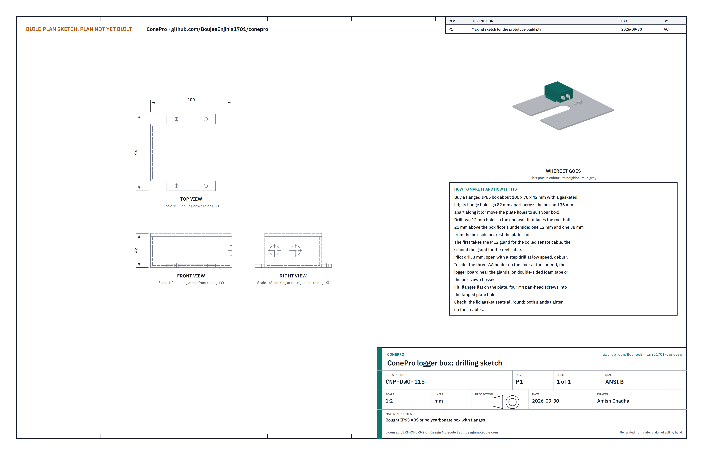

*Figure 24. Logger box drilling sketch (CNP-DWG-113).*

**What it is and what it is made from.** The sealed box on the plate that holds the BLE logger board and three AA cells. A bought flanged IP65 box about 100 x 70 x 42 mm and two M12 cable glands.

**How to make it.**

1. Drill two 12 mm holes in the end wall that will face the rod, both 21 mm above the underside of the box: one 12 mm and one 38 mm from the side nearest the plate slot. Pilot 3 mm, open with a step drill at low speed, deburr.
2. Fit the glands: the first for the coiled pad cable, the second for the reel cable.
3. Fix the cell holder on the floor at the far end and the logger board near the glands, on the box's bosses or double-sided foam tape.
4. Wire as Figure 25 shows.

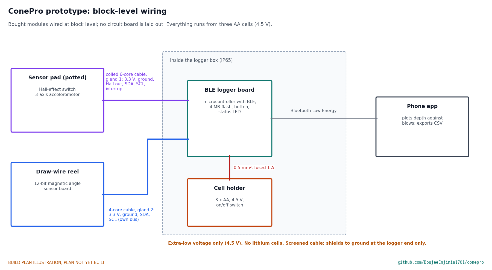

*Figure 25. Block-level wiring. No circuit board is laid out at this stage; bought modules are wired at block level.*

1. Coiled cable, pad to logger, six cores: 3.3 V, ground, Hall output, the two bus lines and the accelerometer's interrupt.
2. Reel cable, four cores: 3.3 V, ground and the two bus lines of the angle sensor, on their own bus.
3. Cell holder to the logger board's battery input through a 1 A fuse and the on/off switch, 0.5 mm² wire.
4. Cable shields to ground at the logger end only.

**How it fits the parts next to it.**

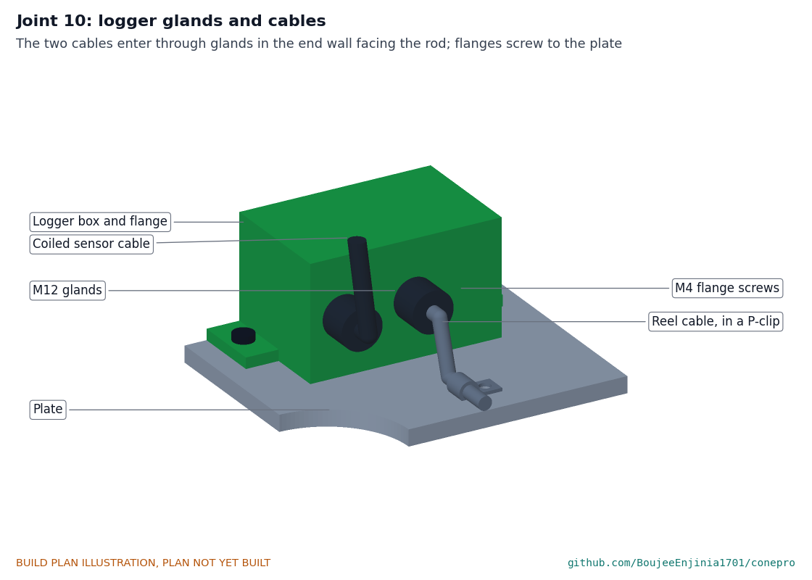

*Figure 26. Both cables enter through glands in the end wall; the flanges screw to the plate.*

The flanges lie flat on the plate and four M4 pan-head screws go into the tapped holes. The reel cable lies on the plate in two P-clips.

**Check before moving on.** The lid gasket seats all round; both glands grip their cables; every wire continues end to end.

### 3.14 Bought components

Buy to specification, not brand. Line numbers are those of the bill of materials.

- **Magnets (line 4).** Sixteen 8 x 4 mm N42 nickel-plated discs, plus one spare.
- **Roll pin and handle parts (line 6).** 6 x 40 mm spring steel roll pin; 20 mm bullseye level; two push-in tube caps for 26 mm tube.
- **Reel parts (line 8).** Two 6 x 13 x 5 mm sealed ball bearings; 6 mm silver steel shaft; constant-force spring motor of about 3 N retracted and 5 N extended; 6 x 2.5 mm diametric magnet; 12-bit magnetic angle sensor board about 30 x 30 mm; 0.45 mm coated 7x7 stainless wire; a ceramic or brass wire eyelet; a compression spring about 8 mm outside diameter, 15 mm free length, 2 N/mm; a crimp sleeve.
- **Sensor pad parts (line 10).** Hall-effect switch and 3-axis MEMS accelerometer on a small board, both rated to 10,000 g shock; 4 mm elastomer sheet; 12 mm stainless worm-drive band clamp for 50 to 80 mm.
- **Logger (line 11).** BLE microcontroller board with 4 MB flash, button and LED; three-AA holder with a switch; flanged IP65 box about 100 x 70 x 42 mm; three M12 cable glands (two for the logger, one for the reel).
- **Coiled cable (line 12).** Six-core screened coiled cable about 1.2 m extended, with strain reliefs.
- **Reel cable (line 17).** Four-core screened cable about 0.5 m, 5 mm outside diameter; two 5 mm P-clips.
- **Fixings (line 14).** Stainless: 4 x M4 x 14 countersunk screws (reel), 4 x M4 x 10 pan-head screws (logger), 2 x M4 x 8 screws (P-clips), 4 x M3 x 10 screws (reel lid), 1 x M5 x 25 socket screw (clamp), 1 x M3 set screw (drum); 4 M4 and 4 M3 brass heat-set inserts; medium thread locker; slow-setting epoxy; potting epoxy.
- **Carry bag (line 13), extraction lever (line 15) and extension rod (line 16)** are not needed to build or check the prototype.

## 4. Putting it together

In each picture the parts already fitted are grey and the part being fitted is in colour, with an arrow showing the way it goes in. Long rods are drawn short where only one end matters.

### Step 1: cone onto the lower rod

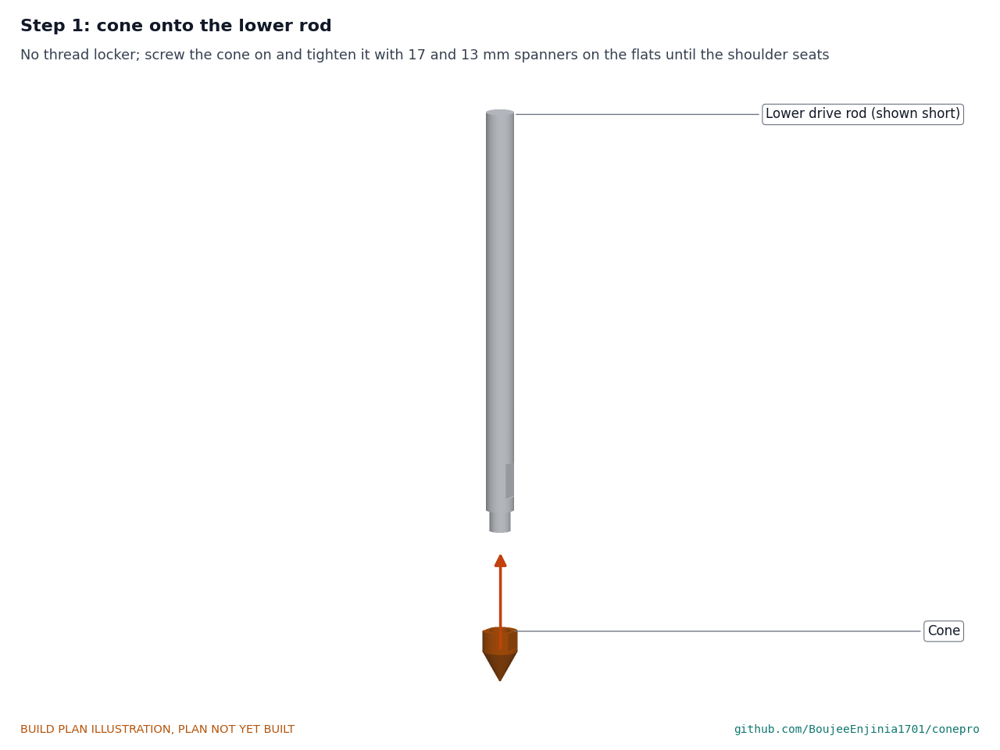

Medium thread locker on the bottom stud; screw the cone on by hand, then hold the cone's body in soft vice jaws and turn the rod until the shoulder seats firmly.

### Step 2: clamp collar onto the lower rod

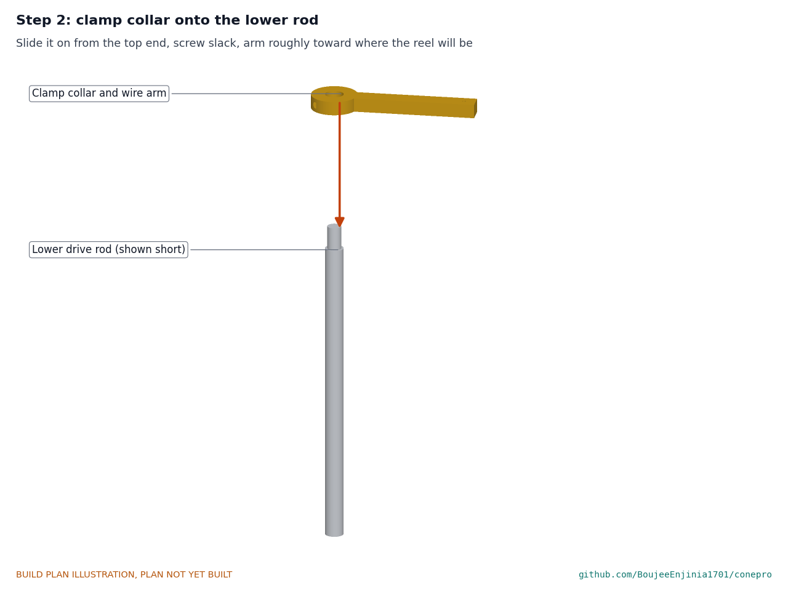

Slide the collar on from the top end with its screw slack.

### Step 3: anvil onto the lower rod

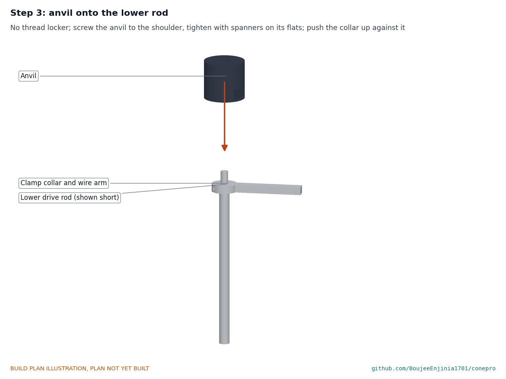

Thread locker on the top stud; screw the anvil down to the shoulder. Push the collar up against the anvil's underside and snug its screw; it is aimed at the reel in step 13.

### Step 4: sensor pad and band onto the anvil

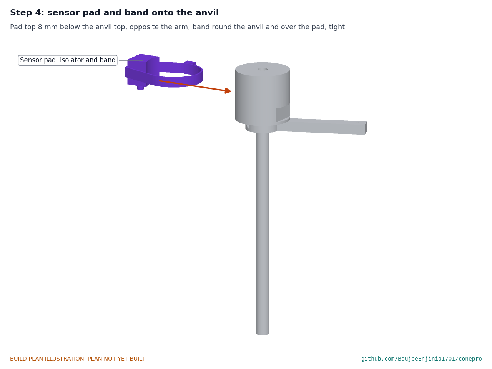

Hold the pad on the side of the anvil opposite the arm with its top 8 mm below the anvil top; pass the band round the anvil and over the pad and tighten it. Lead the coiled cable down.

### Step 5: hammer onto the upper rod

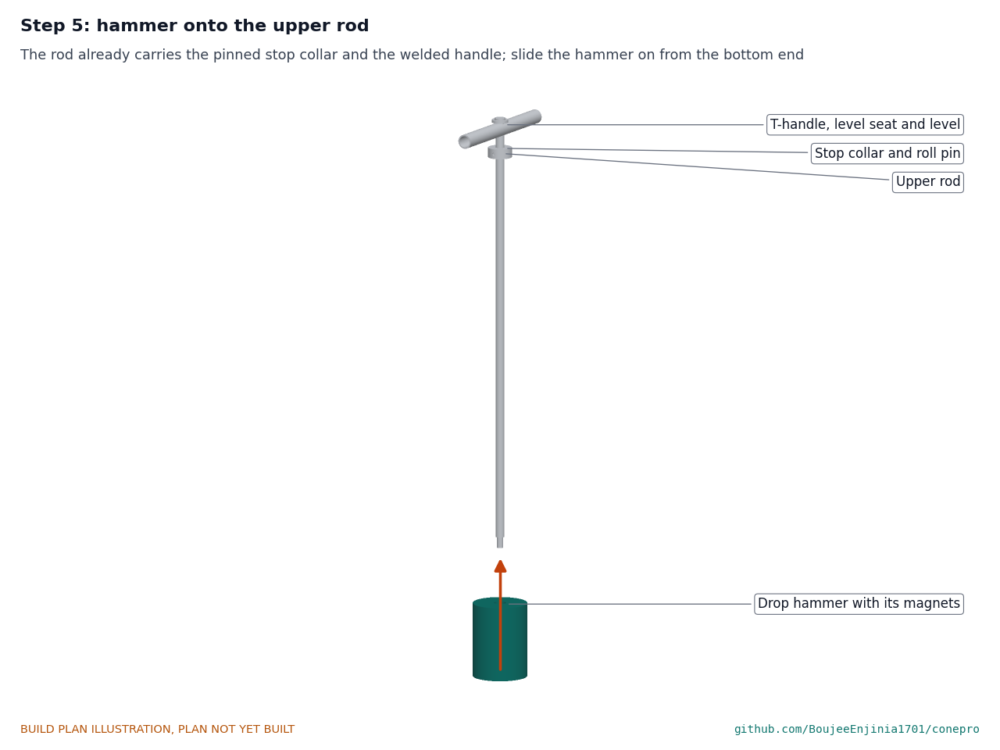

The upper rod already carries the pinned stop collar and the welded handle. Hold it handle down and slide the hammer on from the bottom end, strike face toward the stud. **Hold point:** from now on keep a hand on the hammer whenever the rod is not upright on the anvil.

### Step 6: hammer assembly into the anvil

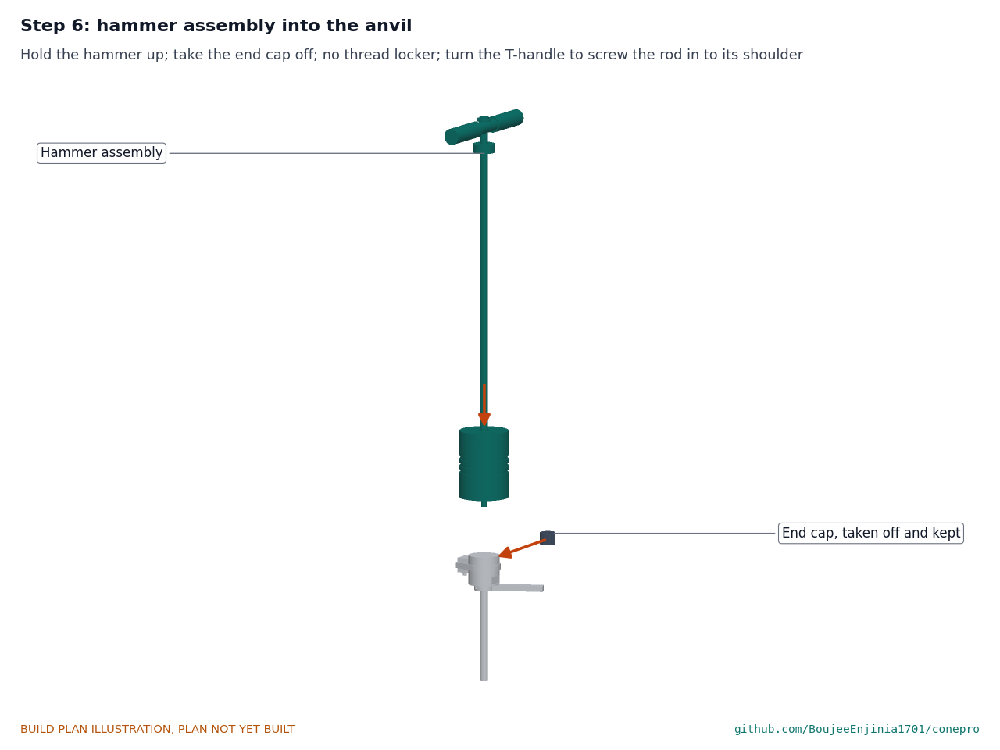

Hold the hammer up at the stop; thread locker on the stud; screw the upper rod into the anvil to its shoulder. Lower the hammer gently onto the anvil.

### Step 7: drum and shaft into the reel housing

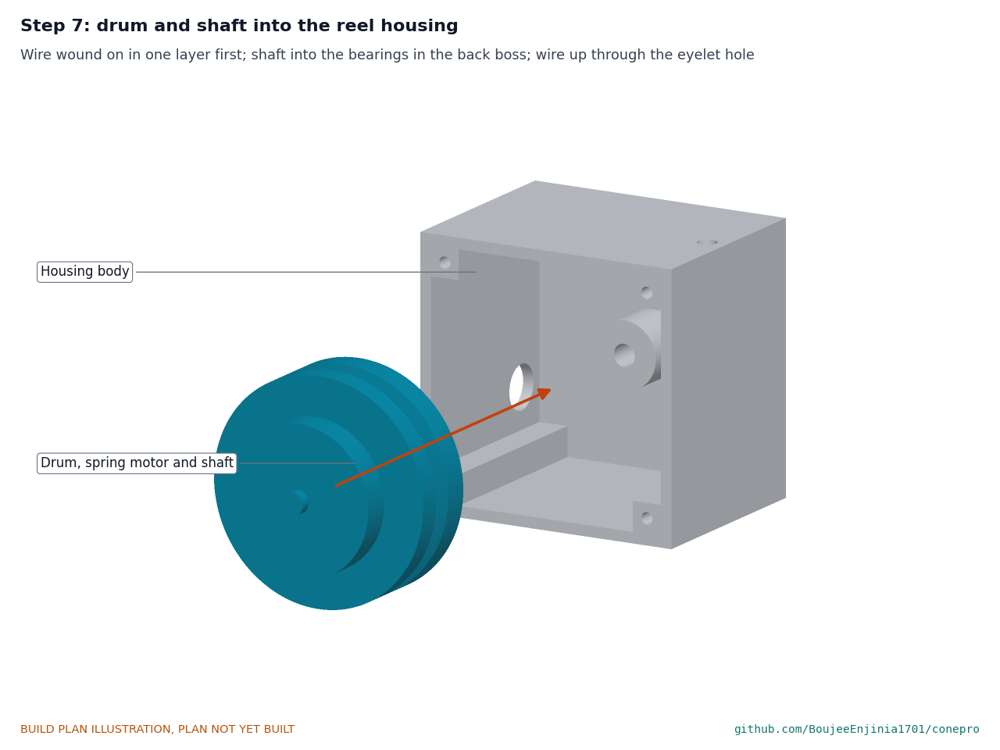

With the wire wound on and the spring motor and magnet fitted, push the shaft into the bearings from the front and lead the wire end up through the eyelet hole.

### Step 8: lid, sensor board and eyelet

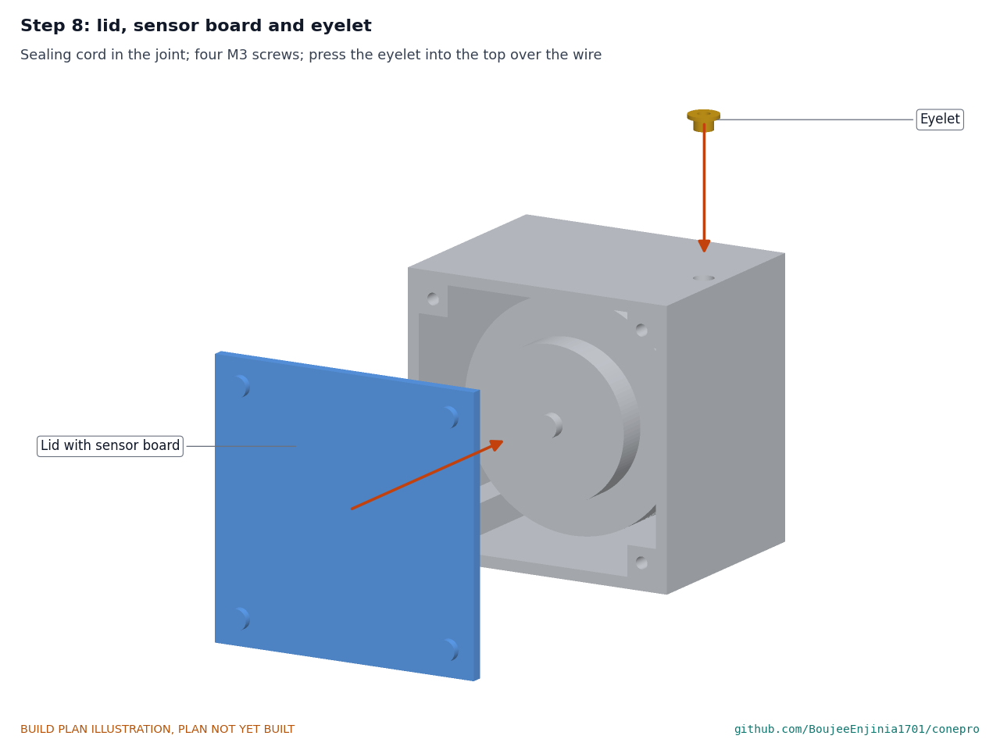

Fix the sensor board to the lid's pad facing the magnet. Lay the sealing cord, fit the lid with four M3 screws, and press the eyelet into the top over the wire. Fit the reel's cable gland.

### Step 9: reel onto the plate

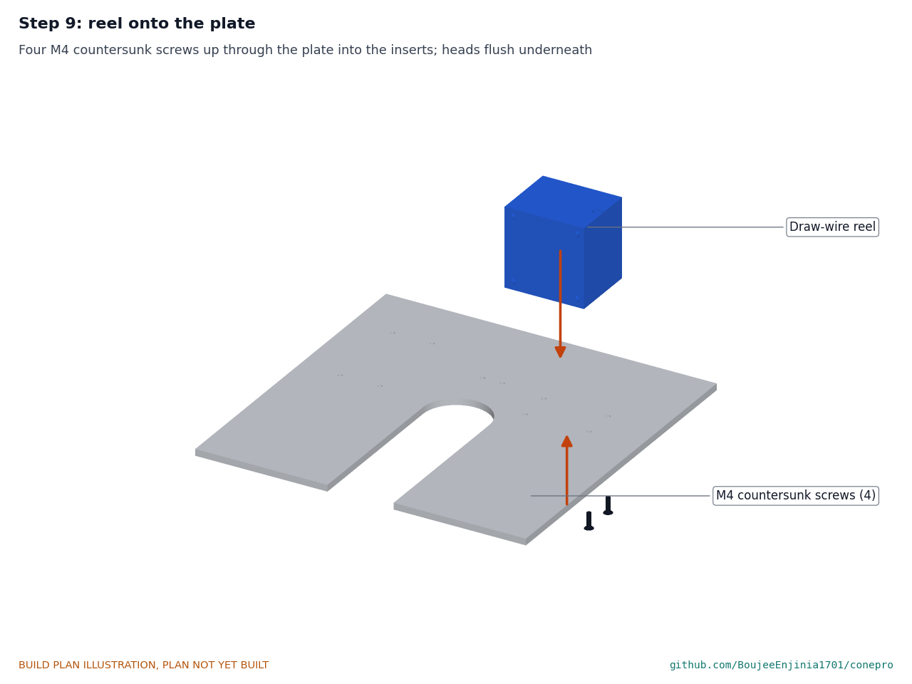

Four M4 countersunk screws up through the plate into the inserts; the heads sit flush underneath.

### Step 10: logger onto the plate

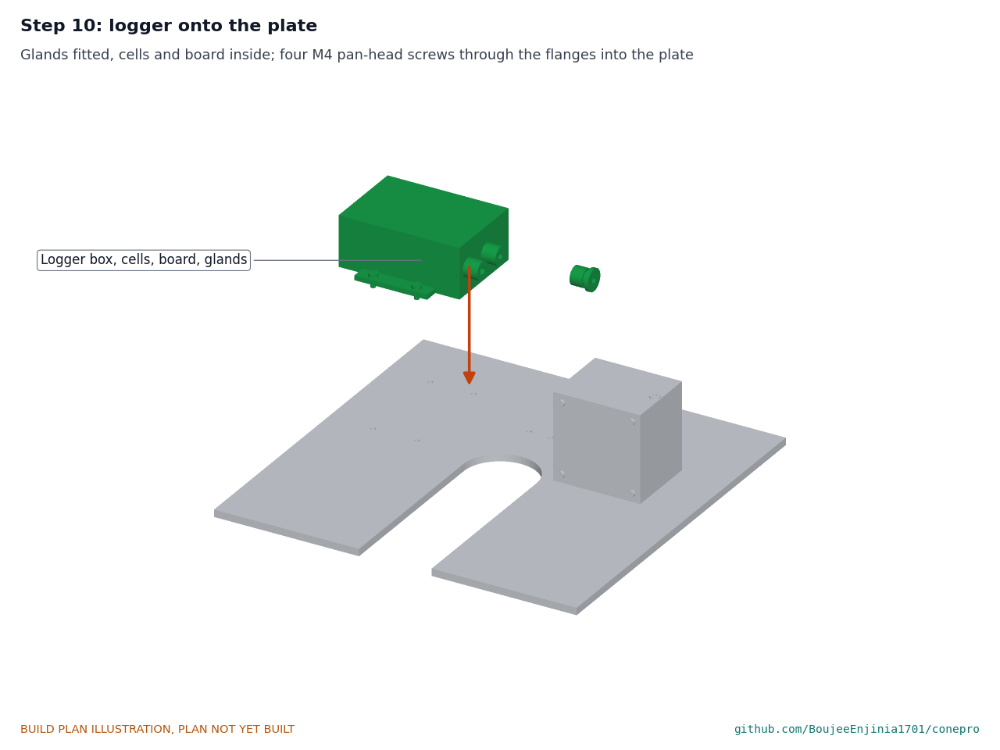

Glands fitted, cells out, board and holder inside. Four M4 pan-head screws through the flanges into the plate.

### Step 11: reel-to-logger cable

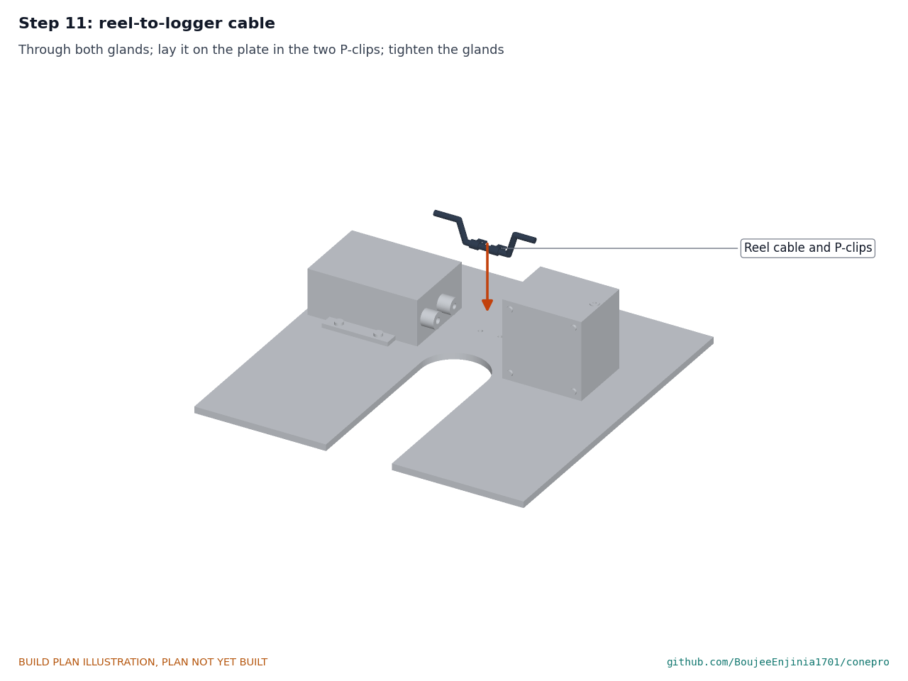

Pass the cable through both glands, connect it at both ends, lay it on the plate in the two P-clips and tighten the glands. **Hold point:** the wiring checks of section 3.13 pass before the cells go in.

### Step 12: plate round the rod at the test point

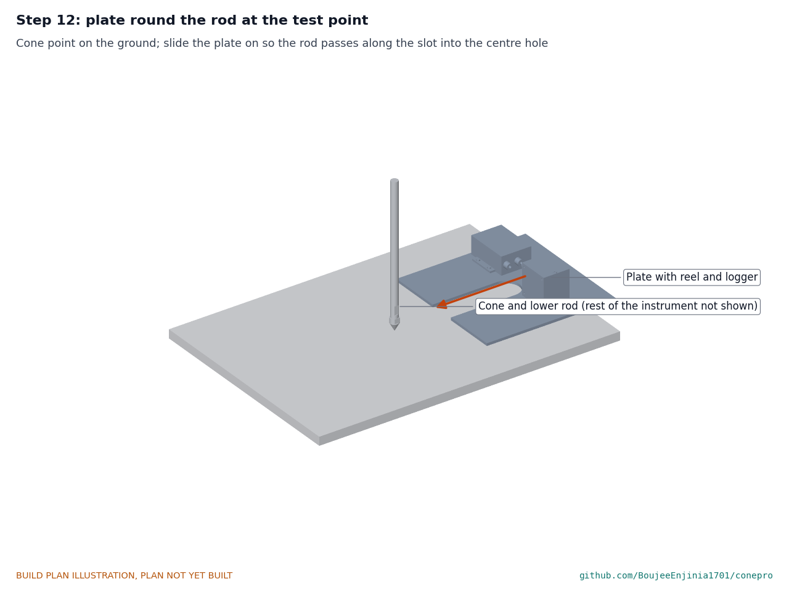

Stand the instrument with its cone point on the ground. Slide the plate on so the rod passes along the slot into the centre hole, reel toward the clamp arm.

### Step 13: wire to the arm and cable to the logger

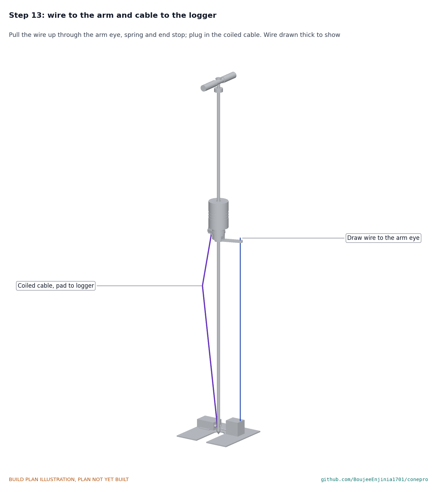

Turn the clamp arm so its eye is straight above the wire exit and tighten the M5 screw. Pull the wire up through the eye, thread on the spring, crimp the end stop on the wire with the spring just touching the arm. Lead the coiled cable down to the logger's first gland and tighten the gland. **Hold point:** safety stop S4 in section 6.

## 5. First checks

These are the checks a TRL 4 test report would record; this plan only lists them. Requirement numbers are those of CNP-REQ-001.

*Table 2. First checks.*

| Check | Requirement | How | Pass when |
| --- | --- | --- | --- |
| Hammer mass and drop | R1 | Weigh the hammer; measure from the anvil top to the hammer face at the stop | 8.00 kg within 10 g; 575 mm within 2 mm |
| Cone size and angle | R1 | Calipers and an angle gauge | 20.0 mm within 0.1 mm; 60° |
| Rod joints | R1 | Look at each shoulder with the joint tight | No gap at any shoulder |
| Hammer slides freely | R1 | Lift to the stop and let go, ten times | It falls freely every time and lands square |
| Wire runs freely | R2, R5 | Push the arm down the full 850 mm by hand and let it rise | The wire pays out and rewinds in one layer, with no slack at the drum |
| Depth reading | R2 | Logger on, rod vertical in a bench stand; compare the reading with the engraved rod at ten points over 850 mm | Within ±1 mm at every point |
| Blow count | R3 | Twenty blows on a soft target (a crate of sand) | Twenty blows counted, none extra |
| Tilt warning | R6 | Lean the rod past 5° | The warning shows between 4.7° and 5.3° |
| Clamp holds | R11 | Twenty blows, then look at the collar and arm | The collar is still against the anvil; the arm has not turned |
| Pad holds | R11 | After the twenty blows, look at the pad and band | No movement, no cracks in the potting |
| Logger sealed | R11 | Look at the lid gasket and both glands | Gasket even all round; glands grip their cables (the spray test comes later) |
| Mass and packed length | R10 | Weigh the set in its bag; measure the longest piece | 15.7 kg (16 kg or less); heaviest piece 9.8 kg; 1.1 m or less |

## 6. Safety stops

Stop at each point. Carry on only when everything listed is true.

- **S1. Before the first lathe or drill work on hardened steel.** Safety glasses on; the part held in a chuck or vice, never by hand; chips cleared with a brush.
- **S2. Before welding the handle.** A welding screen and gloves; no flammable material within 3 m; the rod and tube clamped square; or the job sent to a shop.
- **S3. Before the hammer goes on the upper rod.** The stop collar pin is fully driven and the handle welds are sound (no cracks, full fillet all round). The magnets are cured in their pockets.
- **S4. Before the first blow.** All three rod joints are tight with thread locker cured; the clamp collar is tight against the anvil; the pad band is tight; no cable crosses the hammer's path or the pad top; safety glasses and hearing protection on; feet clear of the plate edge; nobody within 2 m.
- **S5. Before any blow at a real test point (outside this plan).** A utility locate for that point; the ground is not the edge of a trench or excavation.
- **S6. Before packing.** The upper rod is unscrewed with a hand under the hammer, and the hammer is held or tied so it cannot slide off the rod's lower end.

## 7. Tools, skills and workspace

**Tools.** A metal lathe that can screw-cut M12 x 1.75 and a 1 mm pitch, with a 4-jaw chuck or collets for 16 mm rod and a steady for 1 m rods (or a machine shop for the turned parts); bench drill; drills 1 to 16 mm and a step drill to 12 mm; M3, M4, M5 and M12 x 1.75 taps; hacksaw or bandsaw and a jigsaw with a metal blade; files; countersink; MIG or TIG welder (or a welding shop); 3D printer that prints ASA or PETG with a bed of at least 80 x 80 mm; soldering iron for heat-set inserts and wiring; crimp tool; calipers, steel rule, engineer's square, angle gauge; scale to 10 kg reading 10 g; multimeter.

**Skills.** Lathe turning and threading, marking out, drilling and tapping, basic welding (or a shop for it), through-hole soldering. All circuits run at 4.5 V or less from AA cells; no mains wiring is part of this build.

**Workspace.** A bench about 1.5 m long so the rods can lie flat; a metalwork corner kept apart from the electronics; a ventilated place for the printer and for welding.

**Personal protective equipment.** Safety glasses at the lathe, drill and every blow; hearing protection for blows and sawing; gloves for cut edges and welding; no gloves near a turning lathe or drill.

## 8. Where the numbers come from

- Model and constructability checks: `cad/src/model.py` (`python cad/src/model.py --check`, 64 checks); STEP and STL exports in `cad/step/` and `cad/stl/`.
- Pictures: `cad/src/build_plan_media.py`, using `.kit/build_views.py`; written to `docs/05-build-plan/` and `cad/drawings/CNP-DWG-101` to `CNP-DWG-113`.
- General arrangement: `cad/drawings/CNP-DWG-001.pdf`, Rev P5.
- Calculations: `docs/04-calcs/01-sizing.md` (CNP-CAL-001 v0.4) and `docs/04-calcs/sizing.py`; drop and hammer [A2], [A3], stroke [D1], [D2], depth error [E1] to [E4], wire spring [E5], magnet field [F1], masses [C1] to [C3], cost [L1].
- Bill of materials: `bom/bom.csv`.
- Decisions: `docs/decisions/0004-design-for-construction.md` (CNP-DDR-004), with CNP-DDR-001 to CNP-DDR-003; open items in `docs/06-design-decisions.md` (CNP-DEC-001).
- Requirements: `docs/03-requirements.md` (CNP-REQ-001 v0.6).
